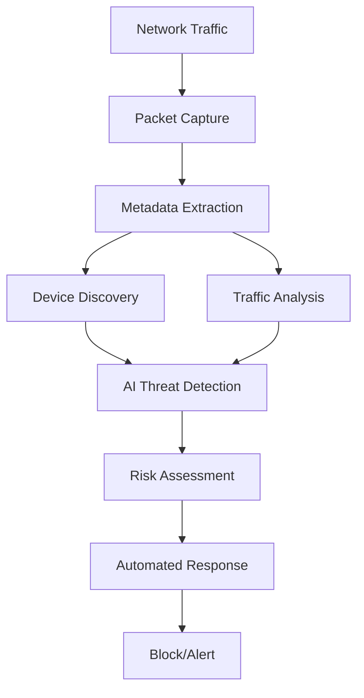
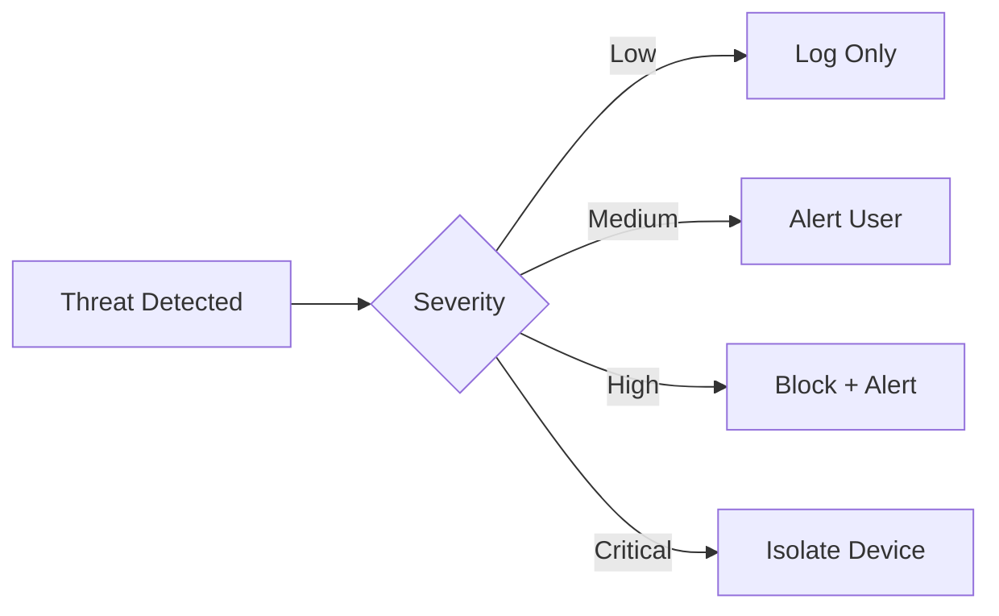

# Architecture

Understanding EdgeGuard's technical architecture and design principles.

## System Overview

EdgeGuard uses a modular architecture designed for IoT security:



:::info Architecture Principles

EdgeGuard is built on three core principles:
- **Privacy First** - All processing happens locally
- **Modular Design** - Independent, testable components
- **Real-Time Performance** - Sub-second threat detection

:::

## Core Components

### 1. Device Discovery Module

**Purpose:** Identify and catalog all devices on the network

**Technology:**
- ARP scanning for active devices
- mDNS for service discovery
- DHCP analysis for device information
- Behavioral fingerprinting

**Output:** Complete device inventory with metadata

```python
# Example device fingerprint
{
  "ip": "192.168.1.100",
  "mac": "AA:BB:CC:DD:EE:FF",
  "hostname": "smart-tv",
  "vendor": "Samsung",
  "device_type": "IoT",
  "first_seen": "2025-01-01T00:00:00Z"
}
```

### 2. Traffic Analysis Engine

**Purpose:** Monitor network packet metadata and patterns

**Technology:**
- Packet capture (libpcap/Scapy)
- Flow analysis and aggregation
- Protocol detection
- Behavioral baseline learning

**Output:** Traffic patterns and anomaly scores

:::tip Performance

Traffic analysis processes only packet headers, not content, ensuring:
- Privacy preservation
- Low CPU usage (10-20%)
- Minimal network overhead (under 1%)

:::

### 3. AI Threat Detection

**Purpose:** Identify security threats using local AI

**Technology:**
- **Model:** Llama 3.2 (3B parameters)
- **Runtime:** Ollama
- **Techniques:** 
  - Behavioral analysis
  - Anomaly detection
  - Pattern recognition
  - Threat classification

**Output:** Threat classifications with confidence scores

<details>
<summary>Detection Capabilities</summary>

| Threat Type | Detection Method | Accuracy |
|------------|------------------|----------|
| Port Scanning | Pattern analysis | 99%+ |
| DDoS Attempts | Traffic volume | 98%+ |
| Data Exfiltration | Behavioral anomaly | 95%+ |
| Botnet Activity | Communication patterns | 97%+ |
| Zero-Day Attacks | AI heuristics | 90%+ |

</details>

### 4. Automated Response System

**Purpose:** React to detected threats automatically

**Technology:**
- iptables for traffic blocking
- DNS filtering
- Device isolation (VLAN)
- Alert generation

**Output:** Blocked connections and user notifications

## Data Flow

The complete threat detection pipeline:

1. **Capture** - Network packets captured at gateway
2. **Extract** - Metadata extracted (headers only)
3. **Analyze** - Behavioral patterns analyzed
4. **Detect** - AI identifies threats
5. **Assess** - Risk score calculated
6. **Respond** - Automatic blocking/alerting

:::success Response Time

- **Detection:** Under 5 seconds
- **Response:** Under 1 second
- **Total:** Under 6 seconds from threat to mitigation

:::

## Privacy Architecture

EdgeGuard's privacy-first design:

### Local Processing
- ✅ All AI analysis on-device
- ✅ No data sent to cloud
- ✅ Complete data sovereignty
- ✅ No external dependencies

### Metadata Only
- ✅ Packet headers, not content
- ✅ No inspection of encrypted traffic
- ✅ Respects user privacy
- ✅ GDPR compliant by design

### Zero Telemetry
- ✅ No usage tracking
- ✅ No analytics collection
- ✅ No phone-home features
- ✅ Fully offline capable

## Technology Stack

### Core Technologies

| Component | Technology | Purpose |
|-----------|-----------|---------|
| Language | Python 3.8+ | Core application |
| AI Model | Llama 3.2 | Threat detection |
| AI Runtime | Ollama | Local inference |
| Packet Capture | Scapy | Network monitoring |
| Database | SQLite | Local storage |

### Key Dependencies

```python
scapy          # Packet capture and analysis
ollama-python  # AI model interface
psutil         # System monitoring
pyyaml         # Configuration management
```

## Performance Characteristics

### Resource Usage

| Resource | Average | Peak | Notes |
|----------|---------|------|-------|
| CPU | 10-20% | 40% | On Raspberry Pi 4 |
| RAM | 1-2GB | 3GB | Includes AI model |
| Storage | 500MB | 1GB | Models and logs |
| Network | Under 1% | 2% | Minimal overhead |

### Detection Performance

- **Device Discovery:** Under 30 seconds for full network
- **Threat Detection:** Under 5 seconds per threat
- **Response Time:** Under 1 second for blocking
- **Accuracy:** 99%+ for known threats, 90%+ for zero-day

## Scalability

EdgeGuard scales across different network sizes:

| Network Size | Devices | Hardware | Performance |
|-------------|---------|----------|-------------|
| Small | 1-10 | Raspberry Pi 3 | Excellent |
| Medium | 10-50 | Raspberry Pi 4 8GB | Very Good |
| Large | 50-100 | Intel NUC / PC | Good |
| Enterprise | 100+ | Dedicated Server | Requires tuning |

:::tip Optimization

For networks with 50+ devices:
- Use dedicated hardware (not Raspberry Pi)
- Increase RAM to 8GB+
- Consider multiple EdgeGuard instances

:::

## Security Model

### Defense Layers

1. **Signature-Based** - Known threat patterns
2. **Behavioral** - Anomaly detection
3. **AI-Powered** - Advanced threat analysis
4. **Heuristic** - Rule-based detection

### Threat Response



## Extensibility

EdgeGuard supports custom extensions:

### Plugin System

```python
from edgeguard import Plugin

class CustomDetector(Plugin):
    def analyze(self, traffic):
        # Custom detection logic
        if self.is_suspicious(traffic):
            return ThreatScore(0.8, "Custom threat")
        return None
```

### API Integration

```bash
# REST API endpoints
GET  /api/devices      # List devices
GET  /api/threats      # List threats
POST /api/whitelist    # Add to whitelist
POST /api/block        # Block device
```

## Next Steps

<div className="row">
  <div className="col col--6">
    <div className="card">
      <div className="card__body">
        <h3>📖 Usage Guide</h3>
        <p>Learn how to use EdgeGuard effectively</p>
        <a href="usage" className="button button--primary">Learn More →</a>
      </div>
    </div>
  </div>
  <div className="col col--6">
    <div className="card">
      <div className="card__body">
        <h3>⚙️ Configuration</h3>
        <p>Customize EdgeGuard settings</p>
        <a href="configuration" className="button button--secondary">Configure →</a>
      </div>
    </div>
  </div>
</div>

