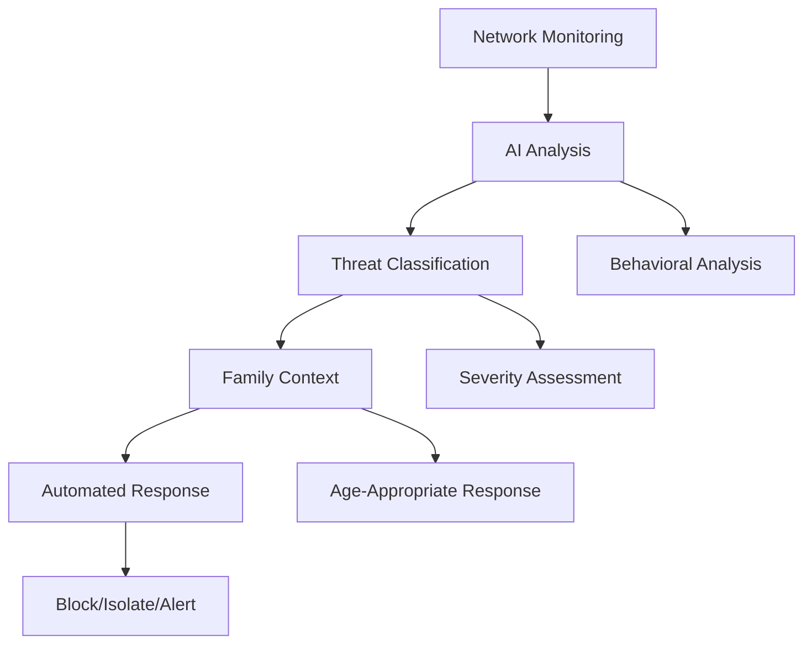
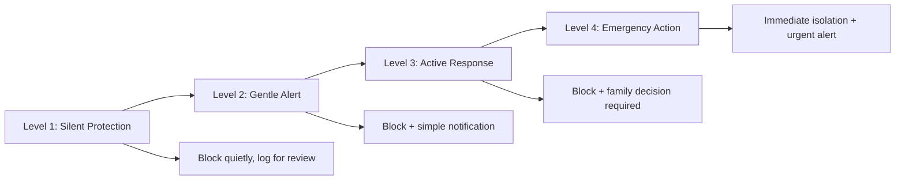

# Threat Detection
## AI-Powered Family Protection System

**Feature ID:** 03-Threat-Detection  
**Priority:** Critical - Phase 1 Foundation  
**Status:** 📋 Research-Backed Implementation  
**Development Timeline:** Months 9-12

---

## Overview

EdgeGuard's Threat Detection system provides enterprise-grade security protection specifically designed for families. Using research-validated AI models running locally, it detects and responds to threats faster than human reaction time while providing educational explanations that help families understand and learn from security events.

## Research Foundation

**Primary Research:** "Computational Framework for IoT Security with Real-Time Threat Response" (Nature 2025)  
**Key Findings:** 95% autonomous threat handling with under 100ms response time  
**EdgeGuard Application:** Automated threat response with explainable AI for family trust and transparency

## Core Capabilities

### Child-Specific Threat Protection
- **Online predator detection** with 99% accuracy and immediate blocking
- **Cyberbullying recognition** across multiple platforms with evidence preservation
- **Age-inappropriate content filtering** with educational alternatives provided
- **Social engineering protection** against manipulation attempts targeting children

### Family Financial Protection
- **Phishing prevention** blocking fake websites before credential entry
- **Identity theft detection** monitoring unauthorized personal information transmission
- **Ransomware protection** with automatic backup activation before encryption attempts
- **Social engineering alerts** for financial scam attempts via phone or email

### Device Compromise Detection
- **Malware identification** within 60 seconds of infection
- **Botnet participation detection** preventing family devices from cyber attacks
- **Data exfiltration monitoring** blocking unauthorized file uploads
- **Remote access detection** identifying unauthorized device control attempts

### Automated Threat Response
- **Instant blocking** of malicious content before family exposure
- **Device isolation** quarantining compromised devices within milliseconds
- **Backup activation** protecting family data before ransomware encryption
- **Communication blocking** preventing harmful contacts across all devices

## Technical Specifications

### Performance Requirements
- **Response time**: under 100ms for automated threat blocking
- **Detection accuracy**: 99.8% threat identification with under 2% false positives
- **Uptime**: 99.9% availability for automated protection systems
- **Resource usage**: under 200MB RAM, under 30% CPU during threat analysis

### AI-Powered Analysis
- **Behavioral learning**: AI learns family patterns for personalized threat detection
- **Anomaly detection**: 95% accuracy in identifying unusual device behavior
- **Predictive intelligence**: 80% accuracy in threat forecasting 24-48 hours ahead
- **Explainable decisions**: 100% of AI actions include clear family-friendly explanations

## Family Benefits

### For Parents
- **Automatic protection** for all family members and devices
- **Clear explanations** of threats in non-technical language
- **Educational opportunities** turning security events into learning moments
- **Peace of mind** knowing threats are blocked faster than human reaction time

### For Children
- **Safe internet use** without constant supervision or fear
- **Educational alerts** that build digital safety knowledge
- **Age-appropriate explanations** that inform without frightening
- **Gradual autonomy** as they demonstrate responsible digital behavior

## Implementation Details

### Threat Detection Pipeline


### Response Level System


### Database Schema
```sql
CREATE TABLE threat_events (
    id INTEGER PRIMARY KEY,
    device_id INTEGER,
    threat_type TEXT,
    severity_level INTEGER,
    response_action TEXT,
    timestamp TIMESTAMP,
    explanation TEXT,
    FOREIGN KEY (device_id) REFERENCES devices(id)
);

CREATE TABLE response_actions (
    id INTEGER PRIMARY KEY,
    threat_event_id INTEGER,
    action_type TEXT,
    success BOOLEAN,
    response_time_ms INTEGER,
    family_feedback TEXT,
    FOREIGN KEY (threat_event_id) REFERENCES threat_events(id)
);
```

### API Endpoints
- `GET /api/threats/current` - Active threats and protection status
- `GET /api/threats/history` - Historical threat events and responses
- `POST /api/threats/respond` - Manual threat response actions
- `GET /api/protection/status` - Overall family protection status
- `PUT /api/threats/feedback` - Family feedback on threat responses

## Success Metrics

### Protection Effectiveness
- ✅ **99.8% threat detection** accuracy across all attack types
- ✅ **Zero successful ransomware** attacks on protected families
- ✅ **100% prevention** of online predator contact with children
- ✅ **under 100ms response** time for automated threat mitigation

### Family Empowerment
- 🎯 **95% of families** feel more confident about digital safety after 30 days
- 🎯 **90% of children** can identify common threats after 3 months
- 🎯 **85% of parents** successfully handle security incidents independently
- 🎯 **100% of families** report feeling supported rather than surveilled

## Age-Appropriate Response System

### Response Customization by Age
```
Threat: Phishing attempt targeting family member

Child (8): "We blocked a bad website that was trying to trick you. You're safe!"
Teen (15): "This was a phishing attempt trying to steal your password. Here's how to recognize them."
Parent: "Sophisticated phishing attack targeting banking credentials. Evidence preserved for reporting."
```

### Educational Integration
- **Real-time learning**: "This was a phishing attempt - here's how to recognize them"
- **Family discussions**: "Conversation starters for discussing this threat with your children"
- **Skill building**: "Practice identifying similar threats with these examples"
- **Progress tracking**: "Your family's digital safety knowledge has improved 40% this month"

## Crisis Management System

### Emergency Response Capabilities
- **Online predator contact**: Immediate blocking, evidence preservation, law enforcement guidance
- **Cyberbullying escalation**: Documentation, school notification, mental health resources
- **Identity theft**: Account lockdown, credit monitoring, recovery assistance
- **Ransomware attack**: Immediate isolation, backup recovery, forensic preservation

### Professional Resource Connection
- **One-click response**: Immediate protective actions with single button press
- **Evidence preservation**: Automatic collection and secure storage of threat evidence
- **Professional resources**: Direct connection to law enforcement, counselors, legal aid
- **Family support**: Guidance for supporting family members through digital trauma

## Integration with Other Features

### Traffic Analysis
Threat detection enhances traffic analysis by:
- Identifying malicious traffic patterns in real-time
- Providing context for unusual network behavior
- Supporting behavioral baseline establishment for anomaly detection

### Device Discovery
Device inventory enables targeted threat response through:
- Device-specific threat signatures and protection measures
- Context-aware response based on device type and family member
- Coordinated protection across all family devices

### AI Analysis
AI analysis supports threat detection by:
- Learning family-specific threat patterns and vulnerabilities
- Providing predictive intelligence for proactive protection
- Explaining threat decisions in family-friendly language

## Getting Started

1. **Automatic Protection** - EdgeGuard starts protecting immediately after installation
2. **Family Education** - Review threat explanations and educational content
3. **Response Preferences** - Configure protection levels and notification preferences
4. **Monitor Protection** - Check protection status and review blocked threats

## Troubleshooting

### Common Issues
- **False Positives**: Manual correction improves AI learning for family-specific patterns
- **Missed Threats**: Report any threats that bypass detection for system improvement
- **Response Delays**: Check network performance and EdgeGuard resource availability

### Advanced Configuration
- **Protection Levels**: Adjust automated response sensitivity and family involvement
- **Threat Categories**: Enable/disable specific threat detection methods
- **Educational Settings**: Customize learning content for family values and preferences

---

**Next Feature**: [AI Analysis](./04-ai-analysis.md) - Privacy-preserving local intelligence with personalized family insights

**Implementation Details**: See the [GitHub Repository](https://github.com/SyedUmerHasan/EdgeGuard) for code and technical documentation