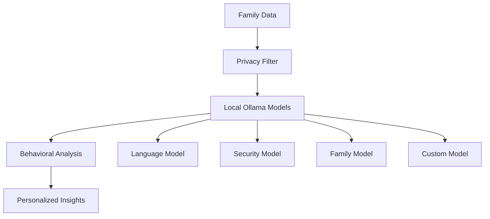
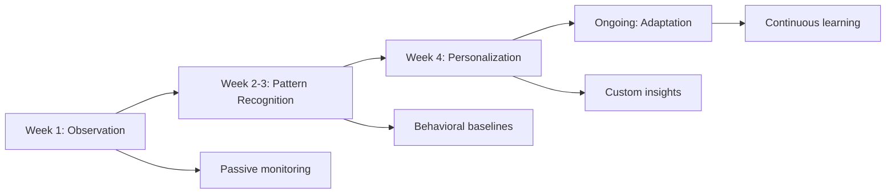

# AI Analysis
## Privacy-Preserving Local Intelligence

**Feature ID:** 04-AI-Analysis  
**Priority:** Critical - Phase 1 Foundation  
**Status:** 📋 Research-Backed Implementation  
**Development Timeline:** Months 9-12

---

## Overview

EdgeGuard's AI Analysis system brings enterprise-grade artificial intelligence directly to your home, running entirely on local hardware with zero data transmission. Using research-validated edge AI techniques, it learns your family's unique digital patterns while maintaining complete privacy through local Ollama processing and formal mathematical privacy guarantees.

## Research Foundation

**Primary Research:** "On-Device LLMs: State of the Union, 2026" (Edge AI Vision 2026)  
**Supporting Research:** 90% model compression with 95%+ accuracy retention on consumer hardware  
**Validation:** Federated learning with formal ε-δ differential privacy guarantees (Informatica 2025)

## Core Capabilities

### Family Behavioral Baseline Learning
- **Individual pattern recognition** - "Dad works from home 9-5, Mom streams 8-10pm, Jake games after homework"
- **Family rhythm understanding** - "Quiet time 7-9pm weekdays, tech-free Sunday mornings"
- **Seasonal adaptation** - "Summer schedule different from school year, holiday patterns"
- **Growth tracking** - "Emma's needs changing as she grows from 8 to 9 years old"

### Privacy-Preserving Local Processing
- **Ollama integration** - Advanced language models running entirely on family's hardware
- **Edge computing** - Real-time analysis without cloud dependencies
- **Encrypted processing** - All data encrypted even during local analysis
- **Zero external calls** - System functions completely offline if needed

### Child-Specific AI Protection
- **Developmental understanding** - "Emma (8) needs different protection than Jake (15)"
- **Maturity assessment** - "Jake ready for more independence, Emma needs more guidance"
- **Educational adaptation** - "Adjust explanations based on child's comprehension level"
- **Growth tracking** - "Gradually increase autonomy as children demonstrate responsibility"

### Predictive Family Safety Modeling
- **Threat forecasting** - "High probability of phishing targeting Jake based on recent data breach"
- **Behavioral prediction** - "Emma's screen time patterns suggest possible social pressure"
- **Risk assessment** - "Family vulnerability increased due to new device additions"
- **Intervention timing** - "Optimal time for family digital wellness conversation"

## Technical Specifications

### Performance Requirements
- **Local processing**: 100% AI analysis on family hardware with zero cloud dependency
- **Response time**: under 2 seconds for real-time AI insights and recommendations
- **Model efficiency**: 1-3B parameter models optimized for Raspberry Pi deployment
- **Resource usage**: under 300MB RAM, under 40% CPU during AI analysis

### Privacy Guarantees
- **Zero data transmission**: Personal information never leaves home network
- **Local model training**: AI improves through local learning only
- **Encrypted processing**: All analysis occurs on encrypted data
- **Formal privacy bounds**: Mathematical guarantees using differential privacy

## Family Benefits

### For Parents
- **AI assistant** that explains security decisions in plain language
- **Personalized insights** based on family's unique digital patterns
- **Predictive guidance** helping prevent problems before they occur
- **Complete transparency** in AI decision-making and learning process

### For Family Members
- **Invisible intelligence** that works quietly in the background
- **Educational explanations** that build digital literacy over time
- **Personalized protection** that adapts to individual needs and growth
- **Privacy assurance** knowing AI analysis never leaves home

## Implementation Details

### Local AI Architecture


### Learning Pipeline


### Database Schema
```sql
CREATE TABLE ai_insights (
    id INTEGER PRIMARY KEY,
    family_id INTEGER,
    insight_type TEXT,
    confidence_score REAL,
    explanation TEXT,
    timestamp TIMESTAMP,
    family_feedback TEXT
);

CREATE TABLE behavioral_patterns (
    id INTEGER PRIMARY KEY,
    device_id INTEGER,
    pattern_type TEXT,
    pattern_data TEXT,
    confidence REAL,
    last_updated TIMESTAMP,
    FOREIGN KEY (device_id) REFERENCES devices(id)
);
```

### API Endpoints
- `GET /api/ai/insights` - Current AI insights and recommendations
- `GET /api/ai/patterns` - Learned family behavioral patterns
- `POST /api/ai/feedback` - Family feedback on AI recommendations
- `GET /api/ai/explanations` - Detailed explanations of AI decisions
- `PUT /api/ai/preferences` - Family AI preferences and boundaries

## Success Metrics

### AI Effectiveness
- ✅ **95% accuracy** in family behavior baseline establishment within 30 days
- ✅ **90% reduction** in false positive alerts after learning period
- ✅ **85% prediction accuracy** for family digital safety issues
- ✅ **100% local processing** with zero personal data transmission

### Family Empowerment
- 🎯 **90% of families** report AI understands their unique needs
- 🎯 **85% satisfaction** with AI recommendations and explanations
- 🎯 **80% improvement** in family digital literacy through AI education
- 🎯 **95% trust** in AI decision-making and transparency

## Multi-Generational Intelligence

### Generational Adaptation
- **Technology comfort levels** - "Grandma needs simple explanations, teenager wants technical details"
- **Communication preferences** - "Dad prefers email alerts, Mom wants mobile notifications"
- **Learning styles** - "Visual learners vs. text-based vs. hands-on demonstration"
- **Cultural bridges** - "Help different generations understand each other's digital habits"

### Inclusive Design
- **Accessibility support** - AI recommendations work for family members with disabilities
- **Language adaptation** - Multi-language support for diverse families
- **Cultural sensitivity** - Respect for different cultural approaches to technology
- **Intergenerational learning** - Facilitate knowledge sharing between generations

## Emotional Intelligence Integration

### Emotional Analysis Capabilities
- **Stress detection** - "Sarah's communication patterns suggest college application stress"
- **Relationship monitoring** - "Family digital interaction decreased 40% this month"
- **Cyberbullying recognition** - "Pattern of messages causing emotional distress to Jake"
- **Mental health awareness** - "Digital behavior changes may indicate depression or anxiety"

### Family Well-being Support
- **Early intervention** - Detect emotional distress before it becomes serious
- **Resource connection** - Suggest appropriate professional help when needed
- **Family communication** - Facilitate healthy discussions about digital wellness
- **Positive reinforcement** - Celebrate healthy digital habits and family connection

## Explainable AI Decisions

### Transparency Features
- **Decision explanation** - "I blocked this website because it contained malware"
- **Confidence levels** - "I'm 95% confident this is a phishing attempt"
- **Learning transparency** - "I learned this from your family's previous preferences"
- **Override capability** - "You can change this decision and I'll learn from it"

### Family Understanding
- **Age-appropriate explanations** - Technical details for adults, simple explanations for children
- **Visual decision trees** - Show how AI reached its conclusions
- **Learning history** - Show how AI's understanding of the family has evolved
- **Bias detection** - Identify and correct any unfair or inappropriate AI biases

## Integration with Other Features

### Device Discovery
AI analysis enhances device discovery by:
- Learning device usage patterns and family member associations
- Predicting when new devices will join the network
- Understanding device relationships and dependencies

### Traffic Analysis
AI provides intelligence for traffic analysis through:
- Behavioral pattern recognition for anomaly detection
- Personalized content categorization based on family values
- Predictive bandwidth optimization recommendations

### Threat Detection
AI analysis supports threat detection by:
- Learning family-specific threat patterns and vulnerabilities
- Providing predictive intelligence for proactive protection
- Explaining threat decisions in family-friendly language

## Getting Started

1. **Automatic Learning** - AI begins learning family patterns immediately after installation
2. **Privacy Setup** - Configure AI boundaries and family preferences
3. **Review Insights** - Check AI recommendations and explanations
4. **Provide Feedback** - Help AI learn family values and preferences

## Troubleshooting

### Common Issues
- **Slow Learning**: AI needs 2-4 weeks to establish accurate family baselines
- **Incorrect Insights**: Family feedback helps AI learn specific preferences and values
- **Resource Usage**: Adjust AI model complexity based on hardware capabilities

### Advanced Configuration
- **Model Selection**: Choose AI models optimized for family's specific needs
- **Learning Boundaries**: Set limits on what patterns AI can learn and analyze
- **Privacy Controls**: Configure differential privacy parameters and data retention

---

**Next Feature**: [Response System](./05-response-system.md) - Automated family-safe actions with graduated response levels

**Implementation Details**: See the [GitHub Repository](https://github.com/SyedUmerHasan/EdgeGuard) for code and technical documentation