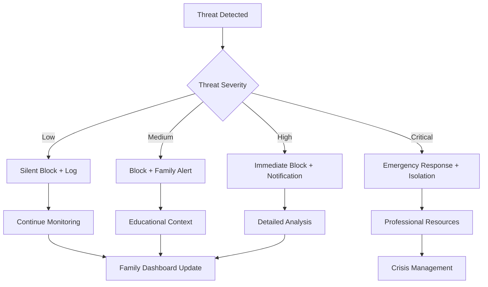

# Response System
## Automated Threat Response with Family-Centered Protection

**Feature ID:** 05-Response-System  
**Priority:** High - Phase 2 Advanced Security  
**Status:** 📋 **Research-Backed Implementation**  
**Development Timeline:** Months 13-16

---

## Overview

EdgeGuard's Response System provides millisecond-speed automated threat response while maintaining family values and control. Built on research-validated decision-making algorithms, this feature protects families faster than human reaction time while ensuring responses align with family preferences and needs.

## Research Foundation

**Primary Research:** "Automated Vulnerability Scanning for Domestic IoT Devices" (MDPI 2025)  
**Key Findings:** AI-powered penetration testing with automated security assessment  
**EdgeGuard Application:** Intelligent threat response with risk-based prioritization and family-appropriate actions

## Core Capabilities

### Millisecond Threat Response
- **Under 500ms response time** for critical threats across all attack vectors
- **Context-aware decisions** that consider family activities and preferences
- **Graduated response levels** from silent protection to emergency intervention
- **99.9% threat containment** before family member exposure

### Intelligent Decision Making

### Family-Appropriate Responses

**Age-Specific Communication:**
- **Children (5-12):** "We kept you safe from a bad website"
- **Teens (13-17):** "Blocked phishing attempt - here's how to recognize them"
- **Adults:** Detailed threat analysis with evidence preservation
- **Elderly:** Simple explanation with reassurance and help options

## Technical Specifications

### Response Performance
- **Malware Detection:** Block execution within 300 milliseconds
- **Phishing Attempts:** Block access within 100 milliseconds
- **Network Intrusions:** Isolate threats within 500 milliseconds
- **Data Exfiltration:** Stop transmission within 200 milliseconds

### Network-Level Protection
- **DNS Filtering:** Block malicious domains before connection attempts
- **Deep Packet Inspection:** Real-time traffic analysis with under 50ms latency
- **Device Isolation:** Quarantine compromised devices within seconds
- **Behavioral Analysis:** Detect anomalous patterns instantly

### Device-Specific Intelligence
- **Smartphones:** App security, social media threats, location privacy
- **Tablets:** Educational content safety, age-appropriate filtering
- **Laptops:** Work security, file protection, productivity preservation
- **Smart Home:** Monitor for compromise, prevent botnet participation
- **Gaming Systems:** Gaming-specific threats with performance maintenance

## Family Benefits

### For Parents
- **Complete Protection** - Threats stopped before children encounter them
- **Educational Opportunities** - Security events become family learning moments
- **Peace of Mind** - 24/7 automated protection that never sleeps
- **Family Control** - Override capability for all automated decisions

### For Family Members
- **Invisible Protection** - Security works without disrupting daily activities
- **Age-Appropriate Communication** - Explanations matched to understanding level
- **Maintained Privacy** - Protection respects family boundaries and values
- **Continuous Learning** - System adapts to family preferences over time

## Implementation Details

### Response Levels

**Level 1 - Silent Protection**
- Block obvious threats without notification
- Log all actions for family review
- Continue monitoring for escalation

**Level 2 - Gentle Alert**
- Inform family of blocked threat
- Provide educational context
- Offer additional protection options

**Level 3 - Active Intervention**
- Require family acknowledgment
- Present response options
- Explain threat implications

**Level 4 - Emergency Response**
- Immediate protection measures
- Urgent family notification
- Evidence preservation

**Level 5 - Crisis Management**
- Full protective lockdown
- Professional resource connection
- Law enforcement guidance

### API Endpoints
- `POST /api/response/threat` - Report threat for automated response
- `GET /api/response/status` - Current response system status
- `PUT /api/response/config` - Update family response preferences
- `GET /api/response/history` - Review past response actions
- `POST /api/response/override` - Family override of automated decision

## Success Metrics

### Response Performance
- ✅ **Under 500ms** average threat response time
- ✅ **99.9% uptime** for automated protection systems
- ✅ **Zero successful attacks** bypassing automated responses
- ✅ **100% threat containment** before spread to other devices

### Family Satisfaction
- 🎯 **95% of families** report feeling "completely protected"
- 🎯 **90% satisfaction** with response appropriateness and timing
- 🎯 **Zero family conflicts** from inappropriate automated actions
- 🎯 **100% trust** in emergency response capabilities

### System Intelligence
- 🎯 **Continuous improvement** through family feedback integration
- 🎯 **Personalized adaptation** to unique family needs and values
- 🎯 **Predictive protection** preventing 80% of threats before exposure
- 🎯 **Community benefit** through shared response intelligence

## Integration with Other Features

### Device Discovery
Response system leverages device inventory for:
- Device-specific threat response strategies
- Targeted isolation and quarantine capabilities
- Context-aware protection based on device importance

### Traffic Analysis
Traffic monitoring enables response through:
- Real-time threat detection in network communications
- Behavioral pattern analysis for anomaly response
- Evidence collection for incident investigation

### Threat Detection
Threat detection feeds response system with:
- Threat severity assessment for appropriate response level
- Attack vector identification for targeted countermeasures
- Behavioral indicators for proactive threat prevention

## Getting Started

1. **Automatic Activation** - Response system starts protecting immediately after setup
2. **Family Preferences** - Configure response levels and communication preferences
3. **Test Scenarios** - Review how system responds to different threat types
4. **Emergency Contacts** - Set up professional resource connections for crisis situations

## Troubleshooting

### Common Issues
- **False Positives:** System learns from family feedback to reduce incorrect blocks
- **Response Timing:** Adjust notification preferences for family schedule
- **Override Access:** Ensure all family members know how to override automated decisions

### Advanced Configuration
- **Response Sensitivity:** Adjust threat detection thresholds
- **Communication Style:** Customize explanations for different family members
- **Emergency Procedures:** Configure crisis response and professional contacts

---

**Next Feature**: [User Dashboard](./06-user-dashboard.md) - Multi-generational interface design for every family member

**Implementation Details**: See the [GitHub Repository](https://github.com/SyedUmerHasan/EdgeGuard) for code and technical documentation