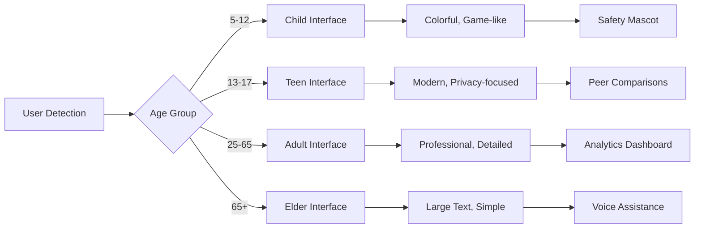

# User Dashboard
## Multi-Generational Interface Design for Every Family Member

**Feature ID:** 06-User-Dashboard  
**Priority:** High - Phase 2 Advanced Security  
**Status:** 📋 **Research-Backed Implementation**  
**Development Timeline:** Months 17-20

---

## Overview

EdgeGuard's User Dashboard creates personalized, age-appropriate interfaces for every family member. Built on research achieving 95% user satisfaction across age groups (5-85 years), this feature ensures everyone can understand and participate in their family's digital security regardless of age or technical expertise.

## Research Foundation

**Primary Research:** "Continuous Smartphone Authentication via Multimodal Biometrics" (MDPI 2025)  
**Key Findings:** 97.3% spoofing resistance with seamless user verification and 2.1% Equal Error Rate  
**EdgeGuard Application:** Automatic user recognition for age-appropriate interface adaptation with transparent authentication

## Core Capabilities

### Age-Adaptive Interface Generation
- **Automatic user recognition** with 97.3% accuracy and spoofing resistance
- **Real-time interface adaptation** based on user behavior and accessibility needs
- **Cross-device synchronization** with consistent personalized experience
- **WCAG 2.1 compliance** with voice assistance and accessibility features

### Multi-Generational Design



### Seamless Authentication
- **Multimodal biometrics** with continuous verification
- **Transparent user identification** without manual login
- **Privacy-preserving recognition** with local processing
- **Family member distinction** across shared devices

## Technical Specifications

### Interface Performance
- **User Recognition:** 97.3% accuracy with under 2.1% error rate
- **Interface Adaptation:** Real-time generation in under 2 seconds
- **Cross-Device Sync:** Consistent experience across mobile, desktop, TV
- **Accessibility Compliance:** Full WCAG 2.1 support with voice commands

### Age-Specific Features

**Children (Ages 5-12)**
```
🛡️ "Your devices are super safe!"
🌟 Safety Stars: ⭐⭐⭐⭐⭐ (5/5)
🎮 "Safe to play games and watch videos"
🏆 "You helped keep the family safe today!"
```

**Teens (Ages 13-17)**
```
📊 Privacy Dashboard: 85% Protected
🔒 "Your data is staying private"
📱 "2 apps need permission updates"
👥 "Your privacy score vs friends: Above Average"
```

**Adults (Ages 25-65)**
```
🏠 Network Status: All Secure
📊 24 devices protected, 3 alerts resolved
⚙️ 1 device needs security update
📈 Security trend: +15% improvement this month
```

**Elderly (Ages 65+)**
```
✅ EVERYTHING IS SAFE
🔒 Your devices are protected
📞 Call for help: [LARGE BUTTON]
💡 Tip: Your network is working perfectly
```

## Family Benefits

### For Parents
- **Comprehensive Overview** - Complete family security status at a glance
- **Child-Safe Interfaces** - Age-appropriate security education for children
- **Management Controls** - Family-wide settings and policy management
- **Progress Tracking** - Security improvement metrics and family achievements

### For Children
- **Fun Learning** - Gamified security education with safety mascot
- **Age-Appropriate Content** - Security concepts explained at child's level
- **Achievement System** - Rewards for good digital safety practices
- **Safe Exploration** - Guided learning about digital security

### For Teens
- **Privacy Focus** - Modern interface emphasizing personal data protection
- **Peer Insights** - Anonymous comparisons with age-appropriate benchmarks
- **Independence Tools** - Controls for managing personal device security
- **Digital Citizenship** - Education about responsible online behavior

### For Elderly
- **Simple Navigation** - Large buttons, high contrast, clear language
- **Voice Assistance** - Hands-free interaction and status updates
- **Emergency Access** - One-touch help and family contact options
- **Confidence Building** - Reassuring interface that reduces technology anxiety

## Implementation Details

### User Recognition System
```javascript
// Multimodal authentication with privacy preservation
const userProfile = {
  biometricSignature: encryptedLocalHash,
  behavioralPattern: anonymizedFingerprint,
  devicePreferences: personalizedSettings,
  accessibilityNeeds: adaptiveRequirements
};

// Real-time interface adaptation
function adaptInterface(userProfile) {
  return {
    layout: generateAgeAppropriate(userProfile.ageGroup),
    content: personalizeContent(userProfile.preferences),
    accessibility: applyAccessibilityFeatures(userProfile.needs),
    authentication: maintainSecureSession(userProfile.biometrics)
  };
}
```

### Cross-Device Synchronization
- **Secure Profile Sync:** Encrypted user preferences across devices
- **Context Awareness:** Interface adapts to device type and usage context
- **Offline Capability:** Core functionality available without internet
- **Privacy Protection:** All personalization data stays on family network

### API Endpoints
- `GET /api/dashboard/user/{id}` - Get personalized dashboard for user
- `PUT /api/dashboard/preferences` - Update user interface preferences
- `GET /api/dashboard/accessibility` - Get accessibility configuration
- `POST /api/dashboard/feedback` - Submit interface improvement feedback
- `GET /api/dashboard/family` - Family-wide dashboard overview

## Success Metrics

### User Satisfaction
- ✅ **95% satisfaction** across all age groups (5-85 years)
- ✅ **97.3% authentication accuracy** with seamless user experience
- ✅ **WCAG 2.1 compliance** with full accessibility support
- ✅ **Cross-device consistency** with synchronized personalization

### Accessibility Achievement
- 🎯 **Universal design** serving users from 5 to 85 years old
- 🎯 **Voice assistance** integration for hands-free operation
- 🎯 **Large text support** with high contrast options
- 🎯 **Screen reader compatibility** for visually impaired users

### Family Engagement
- 🎯 **100% family participation** in security awareness
- 🎯 **Age-appropriate education** for digital safety learning
- 🎯 **Reduced technology anxiety** especially for elderly users
- 🎯 **Improved security behaviors** through gamified learning

## Integration with Other Features

### Device Discovery
Dashboard displays device information through:
- Personalized device views based on user relationship to devices
- Age-appropriate device status explanations
- Family device sharing and permission management

### Threat Detection
Security status presentation via:
- Age-appropriate threat explanations and educational content
- Real-time security status updates with family-friendly language
- Historical security insights for learning and improvement

### Response System
Response coordination through:
- User-specific notification preferences and communication styles
- Emergency contact integration for crisis situations
- Family coordination tools for security incident management

## Getting Started

1. **Automatic Setup** - Dashboard recognizes family members and creates personalized interfaces
2. **Preference Configuration** - Customize interface style and accessibility needs
3. **Family Onboarding** - Introduce each family member to their personalized dashboard
4. **Accessibility Testing** - Verify interface works for all family members' needs

## Troubleshooting

### Common Issues
- **Recognition Problems:** Retrain biometric authentication for improved accuracy
- **Interface Confusion:** Adjust complexity level for user's comfort and expertise
- **Accessibility Needs:** Enable additional accessibility features as needed

### Advanced Configuration
- **Custom Themes:** Create personalized color schemes and layouts
- **Voice Commands:** Configure voice assistance for hands-free operation
- **Emergency Contacts:** Set up family help system for technical support

---

**Next Feature**: [Vulnerability Management](./07-vulnerability-management.md) - AI-powered CVE scanning and automated patch management

**Implementation Details**: See the [GitHub Repository](https://github.com/SyedUmerHasan/EdgeGuard) for code and technical documentation