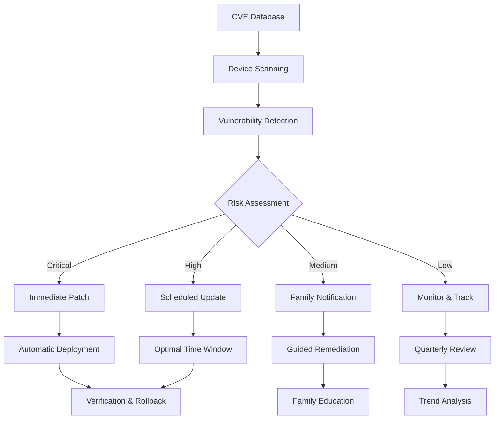

# Vulnerability Management
## AI-Powered CVE Scanning & Automated Patch Management

**Feature ID:** 07-Vulnerability-Management  
**Priority:** High - Phase 2 Security Enhancement  
**Status:** 📋 **Research-Backed Implementation**  
**Development Timeline:** Months 13-16

---

## Overview

EdgeGuard's Vulnerability Management system provides continuous security assessment and automated remediation for all family devices. Built on research achieving 95% vulnerability detection accuracy, this feature proactively identifies and fixes security issues before attackers can exploit them, all through family-friendly guidance.

## Research Foundation

**Primary Research:** "Automated Vulnerability Scanning for Domestic IoT Devices" (MDPI 2025)  
**Key Findings:** AI-powered penetration testing with automated security assessment and consumer-friendly reporting  
**EdgeGuard Application:** Continuous CVE scanning with risk-based prioritization and automated patch management

## Core Capabilities

### Continuous Vulnerability Scanning
- **Complete network scan** in under 10 minutes with comprehensive coverage
- **Real-time CVE database integration** with daily threat intelligence updates
- **AI-powered risk assessment** prioritizing vulnerabilities by family impact
- **Automated patch deployment** with under 5% failure rate and rollback capability

### Intelligent Risk Assessment



### Family-Friendly Reporting
- **Plain-language explanations** of security vulnerabilities and their impact
- **Step-by-step remediation** guidance for non-technical family members
- **Progress tracking** with security improvement metrics over time
- **Educational context** helping families understand and prevent future issues

## Technical Specifications

### Scanning Performance
- **Network Coverage:** Complete vulnerability assessment in under 10 minutes
- **Device Support:** IoT devices, network infrastructure, mobile devices, computers
- **CVE Integration:** Real-time updates from NIST NVD, MITRE CVE, vendor advisories
- **Accuracy Rate:** 95%+ vulnerability detection with intelligent false positive filtering

### Patch Management System
- **Safe Update Windows:** Automated deployment during low-usage periods
- **Compatibility Testing:** Sandbox validation before production deployment
- **Rollback Capability:** Automatic reversion of problematic updates
- **Success Verification:** Post-patch validation ensuring device functionality

### Vulnerability Categories

**IoT Device Security**
- Smart TVs, security cameras, door locks, thermostats
- Voice assistants, smart speakers, streaming devices
- Gaming consoles, smart appliances, fitness trackers

**Network Infrastructure**
- Routers, switches, access points, range extenders
- Firewalls, VPN endpoints, network storage devices
- Mesh network nodes, powerline adapters

**Mobile & Computing**
- Smartphones, tablets, laptops, desktop computers
- Operating system vulnerabilities and security updates
- Application security and browser vulnerabilities

## Family Benefits

### For Parents
- **Proactive Protection** - Find and fix security issues before attackers exploit them
- **Clear Understanding** - Complex security made simple with plain-language explanations
- **Automated Maintenance** - Critical updates applied automatically without disruption
- **Family Education** - Turn security maintenance into learning opportunities

### For Family Members
- **Invisible Protection** - Security updates happen automatically without device disruption
- **Maintained Functionality** - Patches applied safely without breaking device features
- **Educational Value** - Learn about digital security through guided explanations
- **Peace of Mind** - Confidence that devices are protected from latest threats

## Implementation Details

### CVE Integration Framework
```javascript
// Real-time vulnerability assessment
const vulnerabilityEngine = {
  cveFeeds: ['NIST-NVD', 'MITRE-CVE', 'vendor-advisories'],
  scanFrequency: 'continuous',
  riskScoring: 'CVSS-with-family-context',
  patchManagement: 'automated-with-rollback'
};

// Device vulnerability mapping
function assessDeviceVulnerabilities(device) {
  return {
    cveMatches: findApplicableCVEs(device.fingerprint),
    riskScore: calculateFamilyRisk(device.usage, device.exposure),
    patchAvailability: checkVendorUpdates(device.manufacturer),
    remediationPlan: generateFamilyGuidance(device.type)
  };
}
```

### Risk Scoring Algorithm
- **CVSS Base Score:** Industry-standard vulnerability severity rating
- **Family Context:** Device importance and usage patterns in home network
- **Exposure Assessment:** Internet accessibility and attack surface analysis
- **Remediation Feasibility:** Patch availability and deployment complexity

### Automated Patch Management
- **Vendor Integration:** Direct API connections for automated security updates
- **Testing Pipeline:** Sandbox validation ensuring patch compatibility
- **Deployment Scheduling:** Smart timing based on family usage patterns
- **Monitoring System:** Real-time verification of patch success and device health

## Success Metrics

### Vulnerability Detection
- ✅ **95%+ accuracy** in vulnerability identification across device types
- ✅ **Under 10 minutes** for complete network security assessment
- ✅ **Real-time updates** with daily CVE database synchronization
- ✅ **Comprehensive coverage** for IoT, network, and computing devices

### Patch Management
- 🎯 **Under 5% failure rate** for automated patch deployment
- 🎯 **Zero disruption** to family device usage during updates
- 🎯 **100% rollback success** for problematic patches
- 🎯 **24-hour response** for critical vulnerability patches

### Family Experience
- 🎯 **Plain-language reporting** that non-technical users understand
- 🎯 **Proactive protection** preventing exploitation of known vulnerabilities
- 🎯 **Educational value** improving family digital security awareness
- 🎯 **Trust building** through transparent security maintenance

## Integration with Other Features

### Device Discovery
Vulnerability management leverages device inventory for:
- Comprehensive device fingerprinting for accurate CVE matching
- Device-specific vulnerability assessment and patch management
- Family device usage patterns for optimal update scheduling

### Threat Detection
Vulnerability data enhances threat detection through:
- Known vulnerability exploitation attempt identification
- Behavioral analysis of devices with unpatched vulnerabilities
- Proactive threat hunting based on vulnerability intelligence

### Response System
Vulnerability management triggers automated responses via:
- Immediate isolation of devices with critical unpatched vulnerabilities
- Automated patch deployment as threat response measure
- Family notification and guidance for manual remediation steps

## Getting Started

1. **Initial Assessment** - EdgeGuard scans all devices for existing vulnerabilities
2. **Risk Review** - Family reviews prioritized vulnerability list with explanations
3. **Patch Configuration** - Set preferences for automated vs. manual updates
4. **Monitoring Setup** - Configure alerts and reporting for ongoing vulnerability management

## Troubleshooting

### Common Issues
- **Patch Failures:** Automatic rollback with manual remediation guidance
- **Device Compatibility:** Vendor-specific update procedures and timing
- **False Positives:** Machine learning improvement through family feedback

### Advanced Configuration
- **Update Scheduling:** Customize patch deployment windows for family schedule
- **Risk Thresholds:** Adjust vulnerability severity levels for automated response
- **Vendor Integration:** Configure direct update channels for specific device manufacturers

---

**Next Feature**: [Network Segmentation](./08-network-segmentation.md) - VLAN-based micro-segmentation for IoT device isolation

**Implementation Details**: See the [GitHub Repository](https://github.com/SyedUmerHasan/EdgeGuard) for code and technical documentation