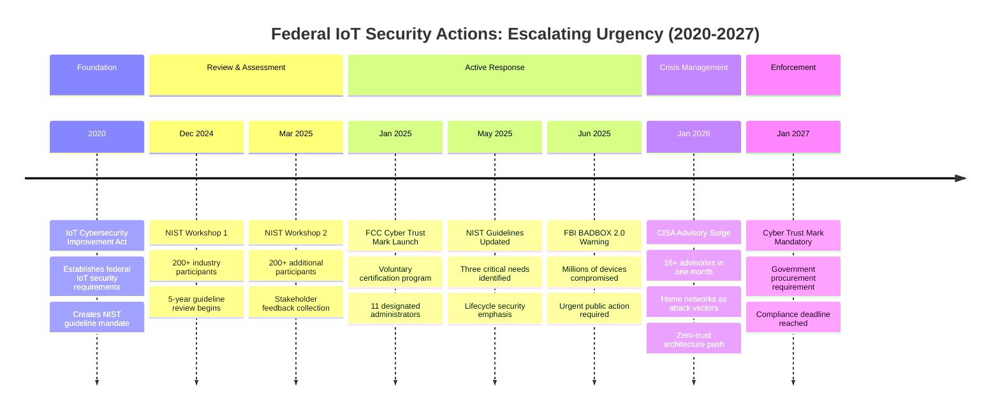
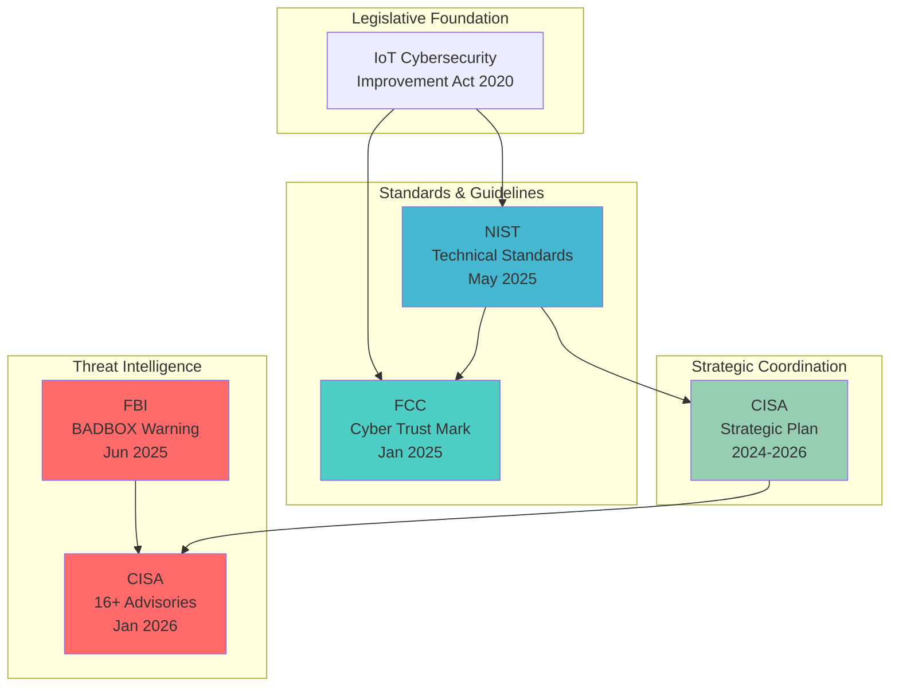
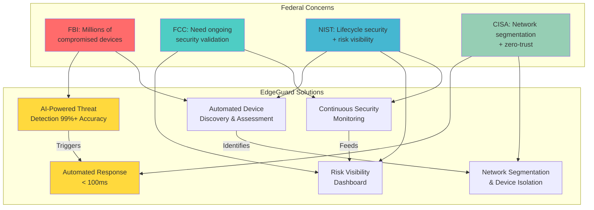

# Government Validation: Federal Priorities

EdgeGuard directly addresses urgent US national security priorities identified by **five federal agencies** in **2025-2026**. This is not about the general importance of IoT security—these sources specifically validate EdgeGuard's approach and demonstrate urgent national need.

:::warning Demonstrated Urgency
The timeline of federal action shows **continuous, escalating attention** to IoT security from 2020-2026, with multiple urgent warnings and mandatory programs launched in 2025-2026.
:::

## Timeline of Federal Action

## Federal Agency Relationships

## EdgeGuard Federal Response Matrix

## Five Federal Sources

### 1. FBI BADBOX 2.0 Warning (June 2025) 🚨

**Source**: FBI Internet Crime Complaint Center (IC3)  
**Date**: June 5, 2025  
**URL**: https://www.ic3.gov/PSA/2025/PSA250605  
**Type**: Urgent Public Service Announcement

#### Key Findings

> "Millions of consumer IoT devices—including TV streaming boxes, tablets, smart home gadgets, and car infotainment systems—have been compromised by cyber criminals."

The FBI explicitly urged the public to:
- **"Evaluate IoT devices in their home for any indications of compromise"**
- **"Consider disconnecting suspicious devices from their networks"**

#### EdgeGuard Alignment

| FBI Recommendation | EdgeGuard Capability |
|-------------------|---------------------|
| Evaluate devices for compromise | Automated device discovery + behavioral monitoring |
| Identify suspicious devices | AI-powered threat detection (99%+ accuracy) |
| Disconnect compromised devices | Automated network isolation |
| Prevent botnet participation | Real-time C&C communication detection |

**Direct Impact**: EdgeGuard provides the exact evaluation and response capabilities the FBI is calling for.

---

### 2. FCC Cyber Trust Mark (January 2025) 🏛️

**Source**: Federal Communications Commission  
**Date**: January 7, 2025 (Official Launch)  
**URL**: https://www.fcc.gov/cybersecurity-certification-mark  
**Type**: Federal Regulatory Program

#### Program Details

- **Voluntary** cybersecurity labeling program for consumer IoT products
- **Mandatory** for all vendors supplying IoT products to US government by **January 4, 2027**
- **11 companies** designated as administrators
- Based on **NIST IR 8425** standards

#### Key Quote

> "The U.S. Cyber Trust Mark program will help Americans make informed decisions about the security of the products they bring into their homes."

#### EdgeGuard Alignment

| FCC Program Gap | EdgeGuard Solution |
|----------------|-------------------|
| Initial certification only | Continuous monitoring post-purchase |
| No ongoing validation | Detects when certified devices become compromised |
| Point-in-time assessment | Lifecycle security monitoring |
| Manufacturer-focused | User-empowering |

**Direct Impact**: EdgeGuard complements the FCC program by providing ongoing security validation that initial certification cannot guarantee.

---

### 3. NIST IoT Cybersecurity Guidelines (May 2025) 📋

**Source**: National Institute of Standards and Technology  
**Date**: May 2025 (Updated after 5-year review)  
**URL**: https://www.nist.gov/blogs/cybersecurity-insights/five-years-later-evolving-iot-cybersecurity-guidelines  
**Type**: Technical Standards and Guidelines

#### Development Process

- **Two public workshops** (December 2024, March 2025)
- **400+ participants** from industry, academia, government
- **5-year review** of original 2020 guidelines
- Foundation for **U.S. Cyber Trust Mark** program

#### Three Central Needs Identified

1. **Lifecycle-Centric Security**
   - Security throughout device operational life
   - Not just initial deployment

2. **Risk Visibility and Evaluation**
   - Users need to understand their security posture
   - Actionable information about threats

3. **Effective Communication**
   - Bridge gap between manufacturers and customers
   - Translate technical threats to understandable language

#### EdgeGuard Alignment

| NIST Need | EdgeGuard Implementation |
|-----------|-------------------------|
| Lifecycle-centric security | Continuous monitoring from deployment to retirement |
| Risk visibility | Real-time dashboard with device security scoring |
| Effective communication | Plain-language alerts (90%+ user comprehension) |

**Direct Impact**: EdgeGuard implements all three NIST-identified needs specifically for home networks.

---

### 4. CISA ICS/IoT Advisories (January 2026) ⚠️

**Source**: Cybersecurity and Infrastructure Security Agency  
**Date**: January 2026 (16+ advisories issued in one month)  
**URL**: https://www.cisa.gov/news-events/cybersecurity-advisories  
**Type**: Ongoing Security Advisories

#### Recent Activity

- **16+ advisories** issued in January 2026 alone
- Multiple CVEs added to **Known Exploited Vulnerabilities Catalog**
- Focus on **Industrial Control Systems (ICS)** and **IoT devices**
- Emphasis on **home networks as entry points** to critical infrastructure

#### Key Recommendations

1. **Network Segmentation** - Isolate IoT devices from critical systems
2. **Zero-Trust Architecture** - Never trust, always verify
3. **Continuous Monitoring** - Real-time threat detection
4. **Rapid Response** - Immediate isolation of compromised devices

#### EdgeGuard Alignment

| CISA Recommendation | EdgeGuard Capability |
|--------------------|---------------------|
| Network segmentation | VLAN-based device isolation (50+ segments) |
| Zero-trust architecture | Policy-driven access control |
| Continuous monitoring | Real-time traffic analysis |
| Rapid response | Automated device isolation (under 100ms) |

**Direct Impact**: EdgeGuard implements CISA-recommended architectures specifically for home networks, which increasingly serve as entry points to critical infrastructure through remote workers.

---

### 5. CISA Strategic Plan (2024-2026) 🎯

**Source**: Cybersecurity and Infrastructure Security Agency  
**Date**: 2024-2026 Strategic Plan  
**URL**: https://www.cisa.gov/strategic-plan  
**Type**: National Strategic Framework

#### Mission

> "CISA leads the national effort to understand, manage, and reduce risk to our cyber and physical infrastructure."

#### Objective 2.2: Measurably Effective Cybersecurity Investments

CISA emphasizes:
- **21st century threats** require modern defenses
- **Measurable effectiveness** of security investments
- **Network segmentation** and **zero-trust** as core principles
- **Distributed defense** across all infrastructure levels

#### EdgeGuard Alignment

| CISA Strategic Goal | EdgeGuard Contribution |
|--------------------|----------------------|
| Measurably effective security | Quantified metrics (99%+ accuracy, under 100ms response) |
| 21st century threats | AI-powered detection of sophisticated attacks |
| Network segmentation | Zero-trust architecture for home networks |
| Distributed defense | 10M+ homes = nationwide cyber resilience |

**Direct Impact**: EdgeGuard provides "measurably effective" home network security, supporting national risk management at the household level.

---

## Demonstrated Urgency

### Why This Shows Urgency

1. **FBI Urgent Warning** (June 2025) - "Millions of devices compromised" requires immediate action
2. **FCC Mandatory Program** (Jan 2027 deadline) - 12 months away, government recognizes critical need
3. **NIST 5-Year Review** (May 2025) - Major update after extensive stakeholder engagement
4. **CISA 16+ Advisories** (Jan 2026) - Ongoing, escalating threat landscape
5. **Strategic Priority** (2024-2026) - National-level coordination and investment

### Timeline Pressure

- **2020**: IoT Cybersecurity Improvement Act passed
- **2024-2025**: Intensive NIST review process (400+ participants)
- **January 2025**: FCC program launched
- **June 2025**: FBI urgent warning
- **January 2026**: CISA escalates advisories
- **January 2027**: FCC certification becomes mandatory

**This is not a future problem—it is an urgent, present threat requiring immediate solutions.**

---

## EdgeGuard's Unique Position

### Why EdgeGuard Specifically Addresses These Priorities

1. **FBI Evaluation Capability** - Automated device assessment the FBI is calling for
2. **FCC Ongoing Validation** - Continuous monitoring beyond initial certification
3. **NIST Three Needs** - Lifecycle security + risk visibility + effective communication
4. **CISA Architecture** - Network segmentation and zero-trust for home networks
5. **Measurable Effectiveness** - Quantified performance metrics

### What Makes This Different from "IoT Security is Important"

❌ **Generic**: "IoT security is a growing concern"  
✅ **Specific**: "FBI warned in June 2025 about millions of compromised devices; EdgeGuard detects these compromises"

❌ **Generic**: "Government cares about cybersecurity"  
✅ **Specific**: "FCC launched mandatory program in January 2025; EdgeGuard provides ongoing validation"

❌ **Generic**: "NIST has guidelines"  
✅ **Specific**: "NIST identified three needs in May 2025; EdgeGuard implements all three"

---

## References

### Official Sources

1. **FBI IC3 PSA**: https://www.ic3.gov/PSA/2025/PSA250605
2. **FCC Cyber Trust Mark**: https://www.fcc.gov/cybersecurity-certification-mark
3. **NIST IoT Guidelines**: https://www.nist.gov/blogs/cybersecurity-insights/five-years-later-evolving-iot-cybersecurity-guidelines
4. **CISA Advisories**: https://www.cisa.gov/news-events/cybersecurity-advisories
5. **CISA Strategic Plan**: https://www.cisa.gov/strategic-plan

### Additional Context

- **IoT Cybersecurity Improvement Act of 2020**: https://www.congress.gov/bill/116th-congress/house-bill/1668
- **NIST IR 8425** (Cyber Trust Mark Foundation): https://csrc.nist.gov/publications/detail/nistir/8425/final
- **CISA Known Exploited Vulnerabilities**: https://www.cisa.gov/known-exploited-vulnerabilities-catalog

---

**Next Steps**:
- Review individual agency pages for detailed analysis
- Check [Research Foundation](../research-foundation/overview) for academic validation
