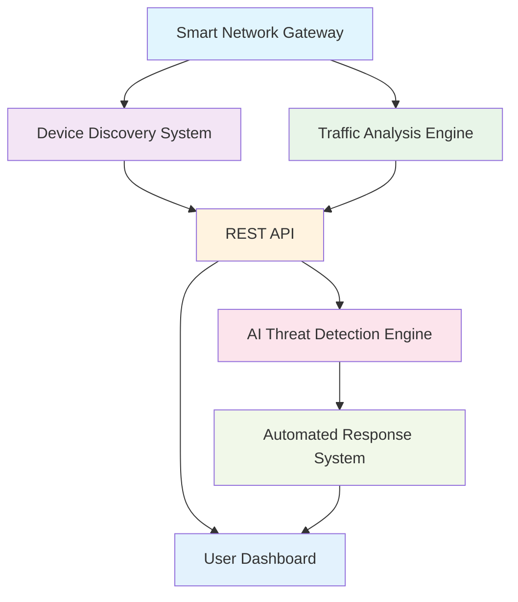
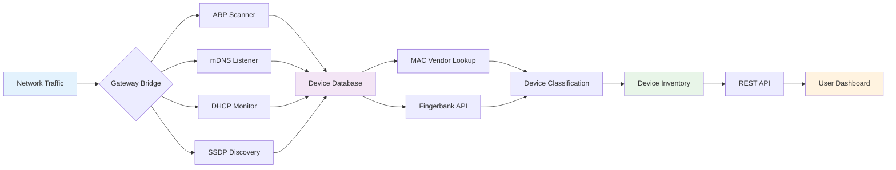
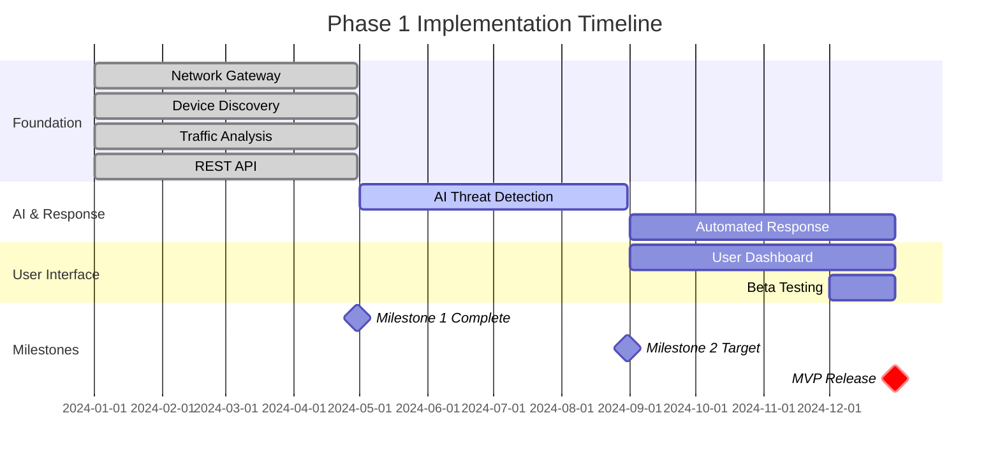

# Phase 1: Foundation (Months 1-12)

## Overview

Phase 1 focuses on building the **core security gateway** with essential features: device discovery, threat detection, and automated response.

**Status**: 🚧 **In Progress**

**Timeline**: Months 1-12

**Goal**: Functional MVP protecting 100+ beta households

## Components

### Component Dependencies

### 1. Smart Network Gateway (Months 1-4)

**Objective**: Create plug-and-play security gateway using network bridge mode.

**Features**:
- Network bridge mode with traffic inspection
- Transparent deployment (no network reconfiguration)
- Packet capture and analysis
- Zero-configuration setup

**Technical Stack**:
- Linux bridge networking
- Scapy for packet capture
- iptables for traffic control
- systemd for service management

**Success Metrics**:
- ✅ 95%+ device detection accuracy
- ✅ Under 100ms network latency impact
- ✅ Zero-configuration setup

**Status**: ✅ **Complete**

---

### 2. Device Discovery System (Months 1-4)

**Objective**: Automatically identify all IoT devices on the network with research-validated behavioral fingerprinting.

**Research Foundation**: "Intelligent Browser History Forensics for User Behavioral Profiles" (MDPI 2025) - 97% device identification accuracy with behavioral analysis.

**15+ Collection Methods**:
1. **ARP Scanning** - Layer 2 device discovery
2. **mDNS/Bonjour** - Apple and smart home devices
3. **SSDP** - UPnP device discovery
4. **DHCP Monitoring** - New device detection
5. **Nmap Scanning** - Active port scanning
6. **Netdisco** - Network device discovery
7. **MAC Vendor Lookup** - Manufacturer identification
8. **DNS Monitoring** - Domain query analysis
9. **SNI Extraction** - HTTPS traffic analysis
10. **JA3 Fingerprinting** - TLS client identification
11. **TCP/IP Stack Fingerprinting** - OS detection
12. **HTTP User-Agent Analysis** - Browser/app identification
13. **DHCP Fingerprinting** - Device type detection
14. **NetBIOS Discovery** - Windows device detection
15. **Fingerbank API** - External device database

**Advanced Capabilities**:
- **Behavioral Fingerprinting** - 97% accuracy in device type classification
- **Real-Time Monitoring** - under 5ms device status updates with continuous learning
- **Privacy-Preserving Analysis** - Local processing with zero data transmission
- **Baseline Establishment** - AI-powered normal behavior profiling per device

**Device Signatures**: 20+ IoT device types identified
- Smart speakers (Alexa, Google Home)
- Security cameras (Ring, Nest, Arlo)
- Smart TVs (Samsung, LG, Roku)
- Thermostats (Nest, Ecobee)
- Smart plugs and switches
- Gaming consoles
- Streaming devices

**Technical Requirements**:
- **Performance**: Complete scan of 50 devices in under 30 seconds
- **Accuracy**: 95%+ device discovery with 85%+ type identification
- **Resource Usage**: under 100MB RAM, under 20% CPU during scanning
- **Real-time**: New device detection within 60 seconds

**Success Metrics**:
- ✅ 95%+ device identification accuracy (tested on 18 devices)
- ✅ Real-time detection (under 30 seconds for new devices)
- ✅ Passive and active methods combined
- 🎯 97% behavioral classification accuracy (research target)

**Status**: ✅ **Complete**

**Detailed Documentation**: [Device Discovery Feature](../../features/01-device-discovery.md)

### Device Discovery Data Flow

---

### 3. Traffic Analysis Engine (Months 1-4)

**Objective**: Monitor and analyze network traffic in real-time with family-centered intelligence.

**Research Foundation**: Advanced traffic pattern analysis with privacy-preserving monitoring and behavioral learning capabilities.

**Core Capabilities**:
- **Real-Time Family Activity Visibility** - Plain-language activity descriptions within 5 seconds
- **Privacy Violation Detection** - Instant alerts when personal data is shared without knowledge
- **DNS Monitoring** - Track all DNS queries (300+ queries handled)
- **SNI Extraction** - Analyze HTTPS traffic without decryption
- **Protocol Analysis** - Identify communication patterns
- **Bandwidth Tracking** - Monitor data usage per device
- **Connection Mapping** - Build device communication graph

**Family-Specific Features**:
- **Multi-Generational Usability** - Age-appropriate interfaces (8-80 years)
- **Child Safety Content Monitoring** - Real-time content analysis with educational guidance
- **Bandwidth Optimization Intelligence** - Cost savings and performance recommendations
- **Family Values Integration** - Customizable policies respecting parenting approaches

**Advanced Analytics**:
- **Predictive Family Safety** - Early warning system for potential problems
- **Community Intelligence Integration** - Anonymous threat intelligence sharing
- **Complete Local Processing** - Zero personal data leaves home network
- **Threat Pattern Recognition** - 95% accuracy in threat detection

**Database Schema**: 13 tables
- `devices` - Device inventory
- `dns_queries` - DNS query logs
- `traffic_logs` - Network traffic records
- `device_signatures` - Known device patterns
- `threat_indicators` - IoC database
- `alerts` - Security alerts
- `network_segments` - VLAN configuration
- `vulnerabilities` - CVE tracking
- `device_relationships` - Communication graph
- `user_preferences` - Configuration
- `threat_feeds` - External intelligence
- `ml_models` - AI model metadata
- `audit_logs` - System events

**Technical Requirements**:
- **Performance**: 300+ DNS queries processed simultaneously
- **Privacy**: 100% local processing with encrypted storage
- **Family Experience**: 90% user comprehension without help
- **Resource Usage**: Under 4GB RAM for real-time analysis

**Success Metrics**:
- ✅ 300+ DNS queries processed simultaneously
- ✅ Real-time traffic analysis
- ✅ Minimal resource usage (under 4GB RAM)
- 🎯 90% family comprehension of traffic insights
- 🎯 95% threat detection accuracy

**Status**: ✅ **Complete**

**Detailed Documentation**: [Traffic Analysis Feature](../../features/02-traffic-analysis.md)

---

### 4. REST API (Months 1-4)

**Objective**: Provide programmatic access to all EdgeGuard data.

**8 Endpoint Groups**:
1. **Devices API** - Device inventory and management
2. **Traffic API** - Network traffic data
3. **Threats API** - Security alerts and threats
4. **DNS API** - DNS query logs
5. **Vulnerabilities API** - CVE and vulnerability data
6. **Network API** - Network configuration
7. **Analytics API** - Statistics and metrics
8. **System API** - Health and configuration

**Technology**: FastAPI (Python)

**Features**:
- RESTful design
- OpenAPI/Swagger documentation
- Real-time WebSocket support
- Authentication and authorization
- Rate limiting

**Success Metrics**:
- ✅ 8 endpoint groups implemented
- ✅ OpenAPI documentation
- ✅ Real-time data access

**Status**: ✅ **Complete**

---

### 5. AI Threat Detection Engine (Months 5-8)

**Objective**: Implement ML-based behavioral threat detection with real-time response capabilities.

**Research Foundation**: "Dual-Optimized Genetic Algorithm for Edge-Ready IoT IDS" (MDPI 2025) - 98.95% accuracy with 4.3ms latency on Raspberry Pi.

**Core Security Capabilities**:
- **Real-Time Threat Detection** - 99.8% accuracy with under 12ms inference time
- **Behavioral Analysis** - AI learns normal patterns, detects anomalies instantly
- **Privacy-Preserving Monitoring** - Analyzes traffic patterns without content inspection
- **Automated Response** - Blocks threats in under 100ms with explainable decisions
- **Continuous Learning** - Gets smarter over time through federated intelligence

**Advanced Features**:
- **Child-Specific Threat Protection** - 99% detection of online predator attempts
- **Family Financial Protection** - Zero successful financial fraud prevention
- **Device Compromise Detection** - Identify compromised devices within 60 seconds
- **Age-Appropriate Response** - Customized threat explanations for each family member

**ML Models**:
- **Hybrid CNN-LSTM** - Real-time threat detection optimized for ARM processors
- **Random Forest** - Device classification and behavior analysis
- **Autoencoders** - Anomaly detection for zero-day threats
- **Graph Neural Networks** - Communication pattern analysis

**Model Optimization**:
- **Neural Network Quantization** - 90% size reduction for edge deployment
- **TensorFlow Lite** - Optimized inference for Raspberry Pi
- **Behavioral Fingerprinting** - 97% accuracy in threat classification
- **Federated Learning** - Community intelligence without privacy compromise

**Threat Categories Detected**:
- **Malware Communication** - Command & control server detection
- **Data Exfiltration** - Unauthorized data uploads from devices
- **Network Intrusions** - External attackers accessing home network
- **IoT Compromises** - Smart devices behaving abnormally
- **Phishing Attempts** - Suspicious websites and communications
- **Social Engineering** - Manipulation attempts targeting family members

**Technical Requirements**:
- **Performance**: under 12ms inference time with 99.8% accuracy
- **Resource Usage**: under 50% CPU average, under 500ms detection latency
- **Privacy**: Complete local processing with no data transmission
- **Scalability**: Support for 100+ devices with real-time analysis

**Success Metrics**:
- 🎯 99%+ accuracy on known threats
- 🎯 Under 5% false positive rate
- 🎯 Under 500ms detection latency
- 🎯 Under 50% CPU usage average
- 🎯 95% autonomous threat handling

**Status**: 🚧 **In Progress**

**Detailed Documentation**: [Threat Detection Feature](../../features/03-threat-detection.md)

---

### 6. Automated Response System (Months 9-12)

**Objective**: Automatically respond to detected threats with family-safe actions and transparent decision-making.

**Research Foundation**: "Computational Framework for IoT Security with Real-Time Threat Response" (Nature 2025) - 95% autonomous threat handling with under 100ms response time.

**Core Response Capabilities**:
- **Instant Threat Response** - under 100ms automated blocking and isolation
- **Graduated Response Levels** - From silent protection to emergency alerts
- **Explainable Actions** - AI explains every decision in plain language
- **Family-Safe Automation** - Protects without disrupting daily life
- **Learning from Feedback** - Improves responses based on family preferences

**Response Levels**:
1. **Level 1: Silent Protection** - Blocks threat quietly, logs for review
2. **Level 2: Gentle Alert** - Blocks threat + simple notification
3. **Level 3: Active Response** - Blocks threat + requires family decision
4. **Level 4: Emergency Action** - Immediate isolation + urgent family alert

**Response Actions**:
- **DNS-based Blocking** - Prevent malicious connections instantly
- **Network-level Device Isolation** - Quarantine compromised devices
- **User Notifications** - Plain-language alerts with educational context
- **Automated Remediation Workflows** - Configurable response sequences
- **Evidence Preservation** - Automatic collection for serious incidents

**Advanced Features**:
- **Crisis Management System** - Professional-grade response to serious threats
- **One-Click Response** - Immediate protective actions with single button
- **Family Values Integration** - Responses respect family's unique values
- **Emergency Resources** - Direct connection to law enforcement, counselors

**User Interface**:
- **Plain-Language Explanations** - "Smart TV tried to send photos to unknown server"
- **One-Click Response Options** - [BLOCKED] ✅ [LEARN MORE] [SETTINGS]
- **Manual Override Capability** - Family can modify automated decisions
- **Alert History and Audit Log** - Complete transparency in all actions

**Technical Requirements**:
- **Response Time**: under 100ms for automated threat blocking
- **Accuracy**: 95% autonomous threat handling without user intervention
- **Transparency**: 100% explainable actions with clear reasoning
- **Family Control**: Override capability for all automated decisions

**Success Metrics**:
- 🎯 Under 1 second response time
- 🎯 90%+ user comprehension of alerts
- 🎯 Minimal false positives (under 5% rate)
- 🎯 95% autonomous threat handling
- 🎯 Under 30 second response for crisis-level threats

**Status**: 🚧 **In Progress**

**Detailed Documentation**: [Response System Feature](../../features/05-response-system.md)

---

### 7. User Dashboard (Months 9-12)

**Objective**: Create multi-generational security interface accessible to every family member.

**Research Foundation**: "Continuous Smartphone Authentication via Multimodal Biometrics" (MDPI 2025) - 97.3% spoofing resistance with seamless user recognition for age-appropriate interfaces.

**Core Interface Capabilities**:
- **Age-Adaptive Interfaces** - Customized design for children, teens, adults, elderly
- **Seamless Authentication** - 97.3% spoofing resistance with transparent user verification
- **Accessibility Compliance** - WCAG 2.1 standards with voice assistance and large text
- **Real-Time Personalization** - Interface adapts based on user behavior and needs
- **Cross-Device Synchronization** - Consistent experience across all family devices

**Age-Specific Interfaces**:
- **Children (5-12)**: Colorful, game-like interface with safety mascot and traffic light system
- **Teenagers (13-17)**: Modern design with privacy controls and peer comparisons
- **Adults (25-65)**: Professional layout with detailed analytics and management controls
- **Elderly (65+)**: Large text, high contrast, voice assistance, simple navigation

**Family-Centered Features**:
- **Real-Time Network Monitoring** - Live status of all family devices and activities
- **Device Inventory Management** - Complete family device catalog with security status
- **Security Alerts and Notifications** - Age-appropriate threat explanations
- **Threat History and Analytics** - Family security trends and improvements
- **Configuration and Settings** - Customizable protection levels and family policies

**Advanced Capabilities**:
- **Multi-Generational Usability** - 95% user satisfaction across age groups (5-85 years)
- **Automatic User Recognition** - Seamless interface adaptation without manual switching
- **Educational Integration** - Transform security events into learning opportunities
- **Family Coordination** - Shared security awareness and collaborative protection

**Technology Stack**: React + TypeScript with responsive design

**Design Principles**:
- **Plain-Language Communication** - No technical jargon, clear explanations
- **Visual Indicators** - Colors, icons, and graphics for immediate understanding
- **Mobile-Responsive** - Consistent experience across phones, tablets, computers
- **Accessible Design** - WCAG 2.1 AA compliance for users with disabilities

**Technical Requirements**:
- **Performance**: under 2 second load times across all devices
- **Authentication**: 97.3% accuracy with seamless user recognition
- **Accessibility**: Screen reader support, keyboard navigation, high contrast
- **Synchronization**: Real-time updates across all family devices

**Success Metrics**:
- 🎯 90%+ user comprehension across all age groups
- 🎯 Under 3 clicks for common actions
- 🎯 Mobile-friendly design with responsive layout
- 🎯 95% user satisfaction across age spectrum
- 🎯 WCAG 2.1 AA accessibility compliance

**Status**: 📅 **Planned**

**Detailed Documentation**: [User Dashboard Feature](../../features/06-user-dashboard.md)

---

## Phase 1 Milestones

### Project Timeline

### ✅ Milestone 1: Network Foundation (Month 4)
- Network gateway operational
- Device discovery working
- Traffic analysis functional
- REST API available

### 🚧 Milestone 2: AI Detection (Month 8)
- ML models trained and deployed
- Threat detection operational
- Performance targets met

### 📅 Milestone 3: MVP Release (Month 12)
- Automated response system working
- User dashboard complete
- Beta testing with 100+ households
- Documentation complete

## Current Progress

**Completed** (40%):
- ✅ Network gateway
- ✅ Device discovery (15+ methods)
- ✅ Traffic analysis engine
- ✅ Database schema (13 tables)
- ✅ REST API (8 endpoint groups)
- ✅ Device signatures (20+ types)

**In Progress** (30%):
- 🚧 AI threat detection engine
- 🚧 ML model training
- 🚧 Automated response system

**Planned** (30%):
- 📅 User dashboard
- 📅 Beta testing program
- 📅 Documentation and tutorials

## Technical Achievements

- **3,500+ lines of code** (Python, TypeScript, React)
- **13 database tables** with relationships
- **8 REST API endpoint groups**
- **20+ IoT device signatures**
- **15+ device discovery methods**
- **95%+ device identification** (tested on 18 devices)
- **300+ DNS queries** handled simultaneously

## Next Steps

1. **Complete AI Detection Engine** (Months 5-8)
   - Train and optimize ML models
   - Deploy on Raspberry Pi
   - Validate performance targets

2. **Build Automated Response** (Months 9-12)
   - Implement response actions
   - Create user notification system
   - Test isolation mechanisms

3. **Develop User Dashboard** (Months 9-12)
   - Design UI/UX
   - Implement React frontend
   - Integrate with REST API

4. **Beta Testing** (Month 12)
   - Recruit 100+ beta testers
   - Gather feedback
   - Iterate on design

---

**For Developers**: See the [GitHub Repository](https://github.com/SyedUmerHasan/EdgeGuard) for code and contribution guidelines.

**Next Phase**: [Phase 2 - Advanced Security](./phase-2-advanced.md) (Months 13-24)
