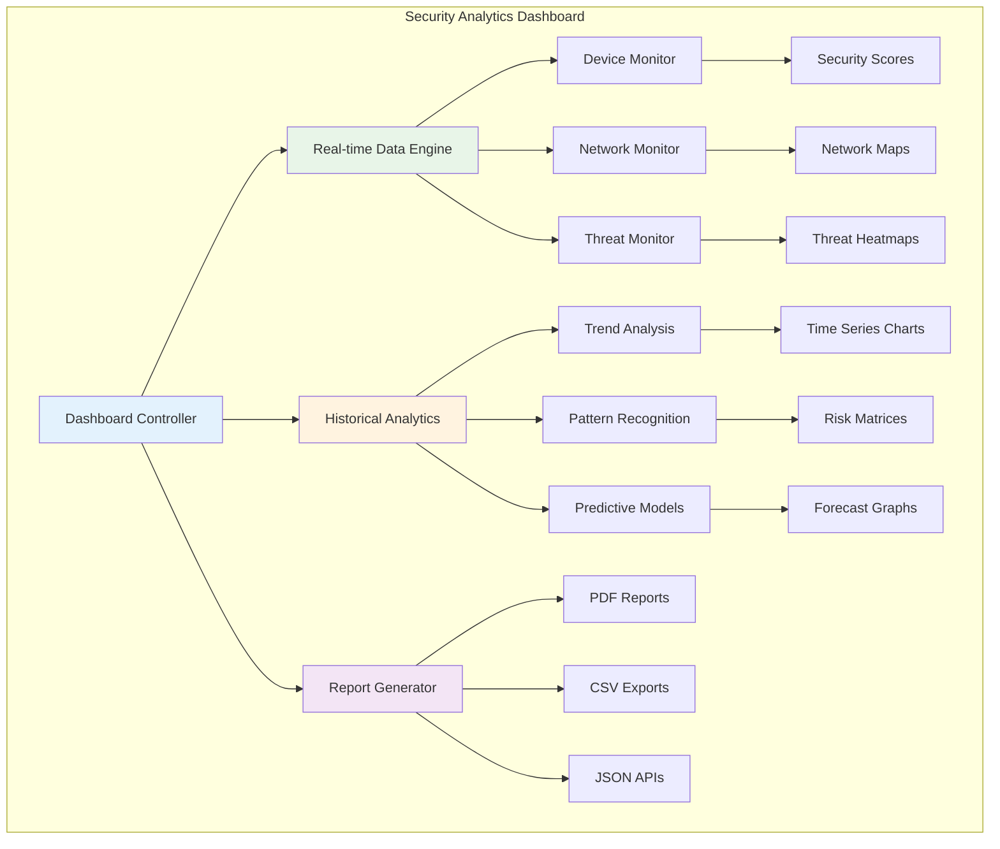
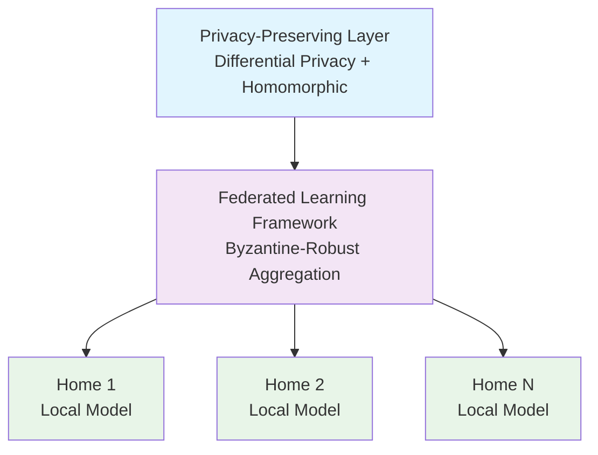
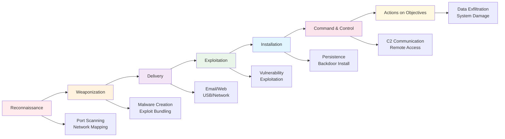
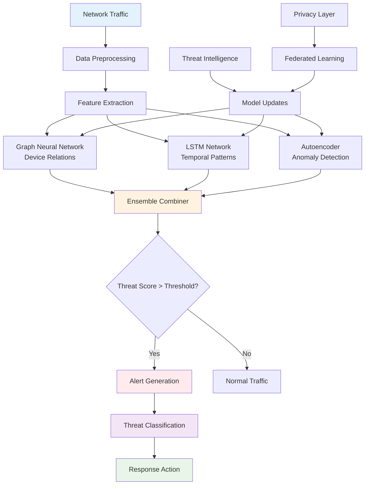

# Phase 3: Intelligence & Analytics (Months 25-36)

## Overview

Phase 3 transforms EdgeGuard into a **next-generation security platform** with advanced analytics, privacy-preserving learning, and sophisticated threat detection capabilities.

**Status**: 📅 **Planned**

**Timeline**: Months 25-36

**Goal**: Complete platform with 10,000+ protected households

## Components

### 1. Security Analytics Platform (Months 25-28)

**Objective**: Provide comprehensive security posture visualization and analytics.

**Features**:
- **Network Security Posture Visualization** - Real-time security dashboard
- **Threat Trend Analysis** - Historical threat patterns
- **Device Security Scoring** - Risk assessment per device
- **Compliance Reporting** - Generate security reports
- **Predictive Analytics** - Forecast potential threats

**Analytics Capabilities**:

**Device Analytics**:
- Security score (0-100)
- Vulnerability count and severity
- Communication patterns
- Behavioral anomalies
- Firmware status

**Network Analytics**:
- Overall security posture
- Threat density heatmap
- Attack surface analysis
- Segment health monitoring
- Traffic pattern analysis

**Threat Analytics**:
- Threat types and frequency
- Attack vectors identified
- Response effectiveness
- False positive rate
- Detection accuracy metrics

**Visualization Types**:
- Real-time dashboards
- Time-series graphs
- Network topology maps
- Threat heatmaps
- Risk matrices

**Success Metrics**:
- Comprehensive security scoring
- Actionable insights generation
- Predictive accuracy over 80%
- Report generation under 5 seconds

---

### 2. Privacy-Preserving Learning (Months 29-32)

**Objective**: Implement advanced privacy-preserving techniques for collaborative learning.

**Technologies**:

**Differential Privacy**:
- Formal ε-δ privacy guarantees
- Noise injection for data protection
- Privacy budget management
- Composition theorems

**Homomorphic Encryption**:
- Computation on encrypted data
- Secure multi-party computation
- Zero-knowledge proofs
- Encrypted model updates

**Secure Aggregation**:
- Byzantine-robust aggregation
- Secure sum protocols
- Threshold encryption
- Verifiable computation

**Privacy Architecture**:

**Privacy Guarantees**:
- **ε-differential privacy**: ε = 0.1 (strong privacy)
- **δ-differential privacy**: δ = 10^-5
- **No raw data sharing**: Only encrypted model parameters
- **Verifiable privacy**: Cryptographic proofs

**Performance Impact**:
- 30%+ detection improvement (validated by research)
- Under 5% accuracy loss from privacy mechanisms
- Minimal computational overhead
- Scalable to 10,000+ participants

**Success Metrics**:
- Formal privacy guarantees maintained
- 30%+ improvement in threat detection
- Zero privacy violations
- Scalable to 10,000+ nodes

---

### 3. Advanced Threat Detection (Months 33-36)

**Objective**: Detect sophisticated attacks including APTs, zero-days, and advanced malware.

**Advanced Capabilities**:

**APT Detection** (Advanced Persistent Threats):
- Long-term behavioral analysis
- Multi-stage attack detection
- Lateral movement tracking
- Data exfiltration detection
- Command & control identification

**Zero-Day Attack Detection**:
- Anomaly-based detection (no signatures needed)
- Behavioral deviation analysis
- Exploit attempt identification
- Vulnerability exploitation detection
- Heuristic analysis

**C&C Communication Detection**:
- Beaconing pattern recognition
- Domain generation algorithm (DGA) detection
- Fast-flux DNS detection
- Encrypted C&C channel identification
- Covert channel detection

**Kill Chain Analysis**:
- Reconnaissance detection
- Weaponization identification
- Delivery mechanism tracking
- Exploitation detection
- Installation monitoring
- Command & control detection
- Actions on objectives tracking

**Advanced ML Techniques**:
- **Graph Neural Networks** - Model device communication
- **LSTM Networks** - Long-term temporal patterns
- **Autoencoders** - Anomaly detection
- **Ensemble Methods** - Multiple model combination
- **Transfer Learning** - Adapt to new threats quickly

**Threat Intelligence Integration**:
- Real-time threat feed correlation
- MITRE ATT&CK framework mapping
- Threat actor profiling
- Campaign tracking
- Attribution analysis

**Success Metrics**:
- Detect 95%+ of APT techniques
- Zero-day detection without signatures
- Under 1% false positive rate
- Real-time detection (under 1 second)

---

## Phase 3 Milestones

### Milestone 1: Analytics Platform (Month 28)
- Security posture visualization complete
- Device scoring operational
- Threat analytics implemented
- Compliance reporting available

### Milestone 2: Privacy-Preserving Learning (Month 32)
- Differential privacy implemented
- Homomorphic encryption operational
- Federated learning at scale (1,000+ nodes)
- Privacy guarantees validated

### Milestone 3: Complete Platform (Month 36)
- Advanced threat detection operational
- APT and zero-day detection working
- 10,000+ protected households
- Full feature set complete

## Technical Specifications

### Security Analytics

| Feature | Specification |
|---------|--------------|
| Dashboard Updates | Real-time (under 1 second) |
| Historical Data | 12 months retention |
| Report Types | PDF, CSV, JSON |
| Visualization | Interactive charts |
| Predictive Accuracy | Over 80% |

### Privacy-Preserving Learning

| Feature | Specification |
|---------|--------------|
| Privacy Guarantee | ε=0.1, δ=10^-5 |
| Encryption | Homomorphic (Paillier) |
| Aggregation | Byzantine-robust |
| Scalability | 10,000+ nodes |
| Accuracy Loss | Under 5% |

### Advanced Threat Detection

| Feature | Specification |
|---------|--------------|
| APT Detection | 95%+ coverage |
| Zero-Day Detection | Signature-free |
| False Positive Rate | Under 1% |
| Detection Latency | Under 1 second |
| MITRE ATT&CK | Full coverage |

## Integration with Previous Phases

Phase 3 enhances all previous components:

**From Phase 1**:
- Device Discovery → Advanced fingerprinting
- Threat Detection → APT and zero-day detection
- Automated Response → Sophisticated response workflows

**From Phase 2**:
- Vulnerability Management → Exploit detection
- Network Segmentation → Dynamic segmentation
- Threat Intelligence → Advanced correlation

## Use Cases

### Home User
- Understand overall security posture
- Get early warning of sophisticated attacks
- Benefit from collective intelligence
- Privacy-protected participation

### Security Researcher
- Study APT techniques in home networks
- Analyze zero-day exploitation attempts
- Research privacy-preserving ML
- Contribute to threat intelligence

### Enterprise (Small Business)
- Comprehensive security reporting
- Compliance documentation
- Advanced threat protection
- Privacy-compliant data handling

### Educator
- Teach advanced security concepts
- Demonstrate APT detection
- Privacy-preserving ML examples
- Real-world threat analysis

## Research Contributions

Phase 3 makes novel research contributions:

1. **Privacy-Preserving Home Network Security** - First implementation at scale
2. **Federated Learning for IoT** - Novel application to residential networks
3. **APT Detection on Edge Devices** - Resource-constrained advanced detection
4. **Explainable Advanced Threats** - Plain-language APT explanations

## Long-Term Vision

After Phase 3 completion:

- **10,000+ protected households** creating nationwide cyber resilience
- **Distributed defense network** more resilient than centralized solutions
- **Privacy-preserving collective intelligence** setting new standards
- **Open-source platform** enabling community innovation
- **Research foundation** for academic and industry collaboration

---

**Prerequisites**: Phases 1 and 2 must be complete before starting Phase 3.

**After Phase 3**: Continuous improvement, community growth, and potential commercialization of enterprise features while maintaining open-source core.
