# Project Plan

## EdgeGuard Development Roadmap

EdgeGuard is an open-source edge-based AI security platform for home IoT networks. This section documents our development plan, research foundation, and implementation timeline.

:::info Project Status
- **Current Phase**: Phase 1 - Foundation (Active Development)
- **Timeline**: 36-month roadmap
- **License**: MIT (Open Source)
- **Repository**: [GitHub](https://github.com/SyedUmerHasan/EdgeGuard)
:::

## Documentation Structure

This section provides comprehensive project documentation organized into key areas:

```mermaid
graph TD
    A[Project Plan] --> B[📋 Project Overview]
    A --> C[🏛️ Why EdgeGuard Matters]
    A --> D[🔬 Research Foundation]
    A --> E[🚀 Development Roadmap]
    A --> F[🌍 Impact & Use Cases]
    A --> G[💡 Technical Innovation]
    
    B --> B1[Project Overview]
    C --> C1[Federal Priorities]
    D --> D1[Research Overview]
    E --> E1[Phase 1: Foundation]
    E --> E2[Phase 2: Advanced Security]
    E --> E3[Phase 3: Intelligence & Analytics]
    F --> F1[Use Cases]
    G --> G1[Technical Innovations]
```

### 📋 Project Overview
Project goals, architecture, and technical specifications.
- [Project Overview](./overview/project-overview)

### 🏛️ Why EdgeGuard Matters
Federal priorities and industry context driving this project.
- [Federal Priorities](./government-validation/federal-priorities)

### 🔬 Research Foundation
Academic research and papers informing our technical approach.
- [Research Overview](./research-foundation/overview)

### 🚀 Development Roadmap
36-month phased implementation plan with milestones.
- [Phase 1: Foundation (Months 1-12)](./implementation/phase-1-foundation)
- [Phase 2: Advanced Security (Months 13-24)](./implementation/phase-2-advanced)
- [Phase 3: Intelligence & Analytics (Months 25-36)](./implementation/phase-3-intelligence)

### 🌍 Impact & Use Cases
Real-world applications and benefits.
- [Use Cases](./impact/use-cases)

### 💡 Technical Innovation
Novel approaches and unique contributions.
- [Technical Innovations](./innovation/unique-contributions)

---

## Development Timeline

**Phase 1 (Months 1-12)**: Core security gateway with device discovery, threat detection, and automated response.

**Phase 2 (Months 13-24)**: Advanced features including vulnerability management, network segmentation, and threat intelligence.

**Phase 3 (Months 25-36)**: Security analytics, privacy-preserving federated learning, and advanced threat detection.

---

## Quick Start

```mermaid
flowchart TD
    Start([New to EdgeGuard?]) --> UserType{What's your role?}
    
    UserType -->|User| U1[📋 Project Overview]
    UserType -->|Developer| D1[🚀 Development Roadmap]
    UserType -->|Researcher| R1[🔬 Research Foundation]
    
    U1 --> U2[🌍 Use Cases]
    U2 --> U3[🏛️ Federal Priorities]
    
    D1 --> D2[Phase 1: Foundation]
    D2 --> D3[💡 Technical Innovations]
    
    R1 --> R2[Research Overview]
    R2 --> R3[💡 Technical Innovations]
    
    U3 --> End([Ready to explore!])
    D3 --> End
    R3 --> End
```

**For Users**: Start with [Project Overview](./overview/project-overview) to understand what EdgeGuard does.

**For Developers**: Check the [Development Roadmap](./implementation/phase-1-foundation) to see current progress and upcoming features.

**For Researchers**: Review our [Research Foundation](./research-foundation/overview) to see the academic basis for our approach.

---

**Last Updated**: February 7, 2025 (Projected timeline through 2026)
