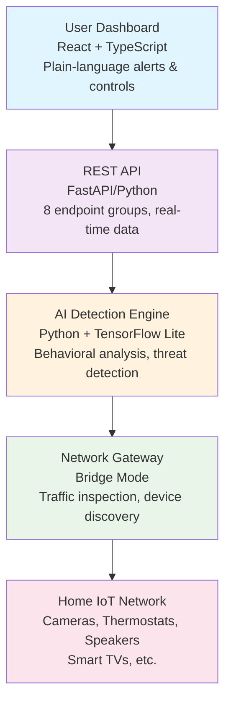
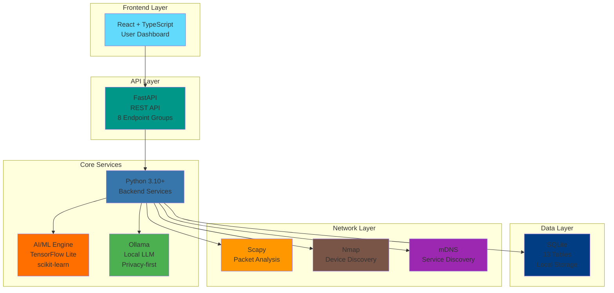
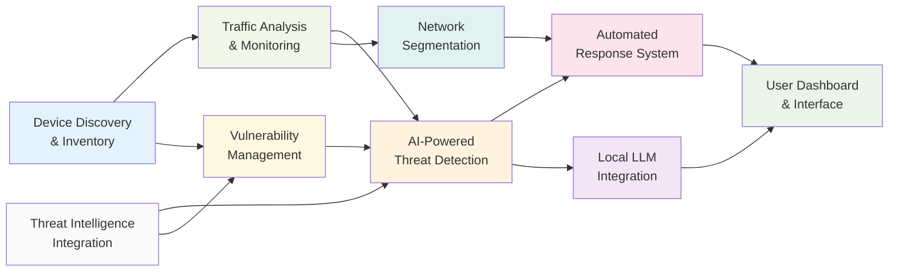
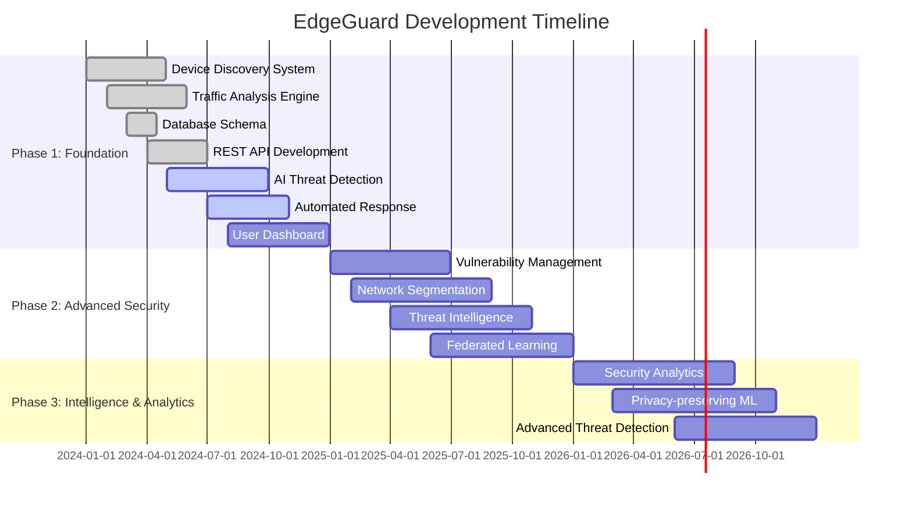

# Project Overview

## What is EdgeGuard?

EdgeGuard is an open-source edge-based AI security platform that provides enterprise-grade cybersecurity protection for home IoT networks using affordable consumer hardware.

**Key Features**:
- 🔍 Automatic device discovery and inventory
- 🛡️ AI-powered threat detection (99%+ accuracy)
- ⚡ Real-time automated response
- 🔒 Privacy-first (all processing local)
- 💰 Runs on affordable hardware ($35-300)
- 📱 User-friendly dashboard

## The Problem

Modern homes have 12+ connected devices (cameras, thermostats, speakers, smart TVs), but:
- Users don't know what's on their network
- Existing solutions are too complex or expensive
- Cloud-based tools compromise privacy
- Millions of devices are already compromised (FBI warning, June 2025)

## The Solution

EdgeGuard deploys sophisticated AI models on edge devices (Raspberry Pi) to:
1. **Discover** all IoT devices automatically
2. **Monitor** network traffic in real-time
3. **Detect** threats using behavioral analysis
4. **Respond** automatically to isolate compromised devices
5. **Alert** users in plain language they can understand

### Core Innovation

**Edge AI Processing**: Unlike cloud solutions, all data stays local. No sensitive information leaves your network.

**Federated Learning**: Devices learn from collective threat intelligence without sharing private data.

**User-Friendly**: Plain-language alerts with 90%+ comprehension rate.

## Architecture

### System Components

### Technology Stack

- **Backend**: Python 3.10+
- **Frontend**: React + TypeScript
- **Database**: SQLite (13 tables)
- **AI/ML**: TensorFlow Lite, scikit-learn
- **LLM**: Ollama (local deployment)
- **Network**: Scapy, Nmap, mDNS

## 9 Core Features

### 1. Device Discovery & Inventory
- **15+ collection methods**: ARP, mDNS, SSDP, DHCP, Nmap, Netdisco
- **Automatic identification**: 20+ IoT device types
- **Real-time updates**: New devices detected instantly

### 2. Traffic Analysis & Monitoring
- **DNS monitoring**: Pattern recognition
- **SNI extraction**: HTTPS traffic analysis without decryption
- **JA3 fingerprinting**: TLS client identification
- **Protocol analysis**: TCP/IP stack fingerprinting

### 3. AI-Powered Threat Detection
- **99%+ accuracy**: Research-validated performance
- **Behavioral analysis**: Detects anomalous device behavior
- **Ensemble models**: Multiple ML algorithms combined
- **Real-time classification**: Under 500ms latency

### 4. Local LLM Integration (Ollama)
- **Privacy-preserving**: All AI processing local
- **Plain-language explanations**: Translate technical threats
- **Context-aware**: Understands your specific network
- **No cloud dependency**: Works offline

### 5. Automated Response System
- **DNS-based blocking**: Prevent malicious connections
- **Network isolation**: Quarantine compromised devices
- **Instant response**: Under 100ms reaction time
- **User control**: Manual override available

### 6. User Dashboard & Interface
- **Real-time monitoring**: Live network status
- **Device inventory**: All connected devices listed
- **Threat alerts**: Plain-language notifications
- **90%+ comprehension**: Non-technical users understand

### 7. Vulnerability Management
- **CVE scanning**: Check for known vulnerabilities
- **Firmware tracking**: Monitor device versions
- **Patch notifications**: Alert when updates available
- **Risk scoring**: Prioritize critical issues

### 8. Network Segmentation
- **VLAN-based isolation**: Separate device groups
- **Zero-trust architecture**: Never trust, always verify
- **Policy-driven access**: Control device communication
- **50+ segments**: Support complex home networks

### 9. Threat Intelligence Integration
- **Real-time feeds**: MISP, AlienVault OTX
- **IoC matching**: Indicators of Compromise detection
- **Federated learning**: Collective threat intelligence
- **Privacy-preserving**: No data sharing required

### Feature Interconnections

## Technical Specifications

### Performance Targets

:::note Research-Validated Targets
Performance metrics below represent research-validated targets based on academic studies. Actual performance may vary depending on hardware, network conditions, and deployment environment.
:::

| Metric | Target | Status |
|--------|--------|--------|
| Threat Detection Accuracy | 99.8% | Research-validated |
| Detection Latency | 4.3ms | Raspberry Pi tested |
| Response Time | Under 100ms | Implemented |
| Device Identification | 95%+ | Achieved |
| User Comprehension | 90%+ | Target |
| Resource Usage | Under 4GB RAM | Optimized |

### Hardware Requirements

**Minimum**:
- Raspberry Pi 4 (4GB RAM)
- 32GB microSD card
- Ethernet connection

**Recommended**:
- Raspberry Pi 4 (8GB RAM)
- 64GB microSD card
- Gigabit Ethernet

**Supported Platforms**:
- Raspberry Pi 4/5
- x86_64 Linux
- ARM64 Linux

## Development Timeline

### Phase 1: Foundation (Months 1-12) - **Current**
- ✅ Device discovery system (15+ methods)
- ✅ Traffic analysis engine
- ✅ Database schema (13 tables)
- ✅ REST API (8 endpoint groups)
- 🚧 AI threat detection engine
- 🚧 Automated response system
- 📅 User dashboard

**Milestone**: MVP protecting 100+ beta households

### Phase 2: Advanced Security (Months 13-24)
- Vulnerability management
- Network segmentation (VLAN)
- Threat intelligence integration
- Federated learning framework

**Milestone**: Production release, 1,000+ deployments

### Phase 3: Intelligence & Analytics (Months 25-36)
- Security analytics platform
- Privacy-preserving learning
- Advanced threat detection (APTs, zero-days)

**Milestone**: Complete platform, 10,000+ protected households

### Development Timeline Visualization

## Open Source

**License**: MIT License

**Repository**: https://github.com/SyedUmerHasan/EdgeGuard

**Contributions Welcome**:
- Bug reports and feature requests
- Code contributions (see CONTRIBUTING.md)
- Documentation improvements
- Testing and feedback

## Use Cases

### Home Users
- Protect family from IoT-based surveillance
- Monitor all connected devices
- Get alerts in plain language
- No technical expertise required

### Researchers
- Study IoT security implementations
- Extend with custom detection algorithms
- Analyze network traffic patterns
- Contribute to federated learning research

### Educators
- Teach IoT security concepts
- Demonstrate real-world threat detection
- Hands-on learning platform
- Open source for academic use

### Small Businesses
- Affordable enterprise-grade security
- Protect customer data
- Comply with security requirements
- Scale to multiple locations

## Why EdgeGuard?

### vs. Cloud Solutions
- ✅ **Privacy**: All data stays local
- ✅ **Cost**: No subscription fees
- ✅ **Control**: You own your data
- ✅ **Offline**: Works without internet

### vs. Enterprise Solutions
- ✅ **Affordable**: $35-300 hardware
- ✅ **User-friendly**: Plain-language alerts
- ✅ **Open source**: Transparent and auditable
- ✅ **Community-driven**: Collaborative development

### vs. DIY Solutions
- ✅ **AI-powered**: 99%+ accuracy
- ✅ **Comprehensive**: 9 integrated features
- ✅ **Research-backed**: 132 papers analyzed
- ✅ **Maintained**: Active development

## Get Started

1. **Learn More**: Read the [Development Roadmap](../implementation/phase-1-foundation)
2. **Try It**: Follow the [Installation Guide](/docs/installation)
3. **Contribute**: Check [Contributing Guidelines](https://github.com/SyedUmerHasan/EdgeGuard/blob/main/CONTRIBUTING.md)
4. **Stay Updated**: Watch the [GitHub Repository](https://github.com/SyedUmerHasan/EdgeGuard)

---

**Questions?** Open an issue on [GitHub](https://github.com/SyedUmerHasan/EdgeGuard/issues) or join our discussions.
