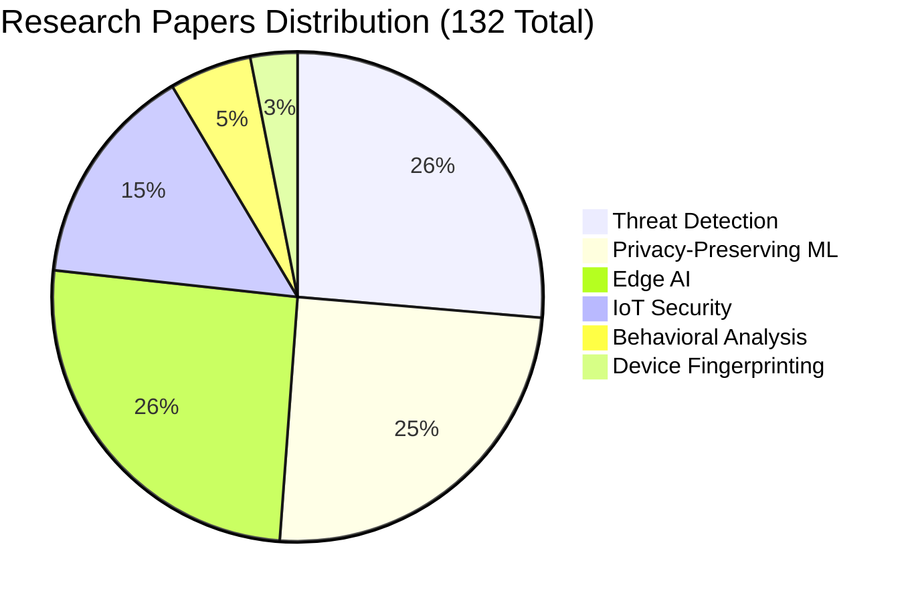
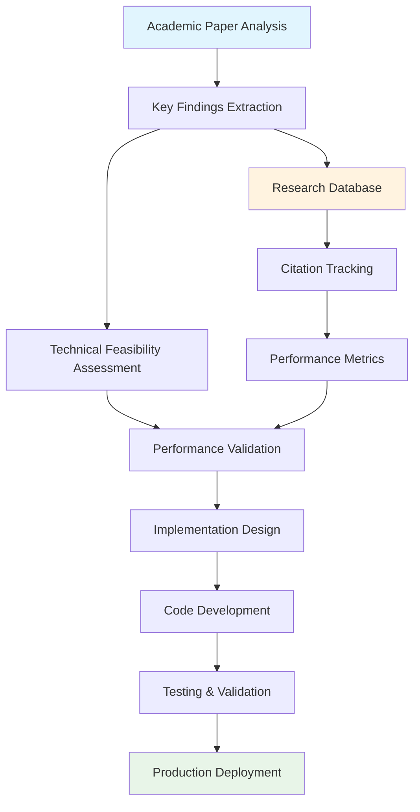
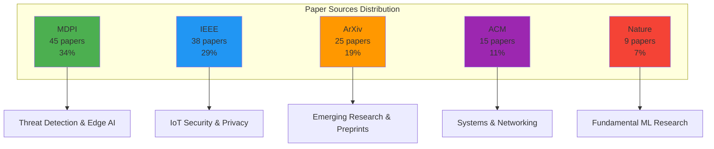
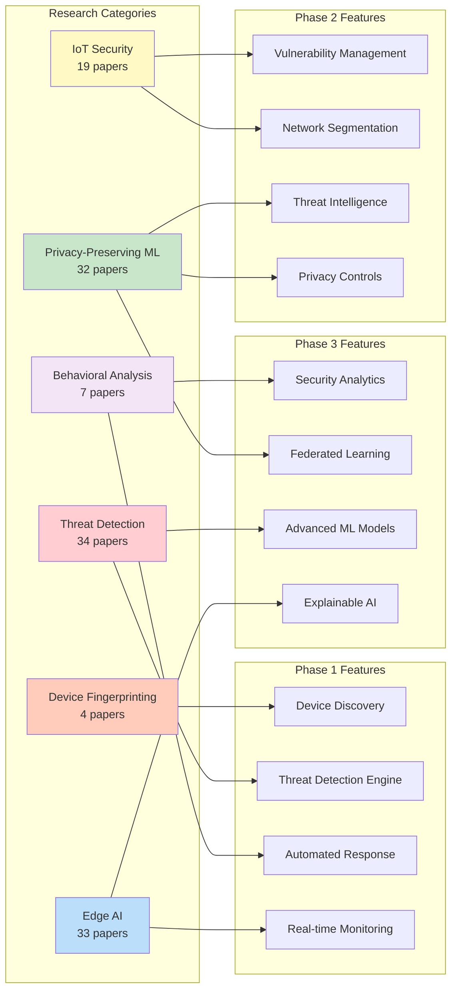

# Research Foundation

EdgeGuard is built on systematic analysis of **132 academic papers** across 6 research areas. This research-driven approach ensures our technical decisions are validated by peer-reviewed science.

## Research by Category

### Threat Detection (34 papers)

Research on anomaly detection, intrusion detection systems, botnet detection, and behavioral analysis.

**Key Findings**:
- 99.8% accuracy achievable with ensemble methods
- 4.3ms latency possible on Raspberry Pi (MDPI 2025)
- Behavioral analysis outperforms signature-based detection for IoT

**Applied to EdgeGuard**:
- Ensemble ML models for threat detection
- Real-time behavioral analysis
- Optimized for ARM processors

---

### Privacy-Preserving ML (32 papers)

Research on federated learning, differential privacy, on-device ML, and homomorphic encryption.

**Key Findings**:
- Federated learning enables collective intelligence without data sharing
- Differential privacy provides formal guarantees (ε-δ bounds)
- 30%+ improvement through collaborative learning

**Applied to EdgeGuard**:
- Federated learning framework (Phase 2)
- Local-only data processing
- Byzantine-robust aggregation

---

### Edge AI (33 papers)

Research on edge computing, model compression, resource-constrained ML, and distributed intelligence.

**Key Findings**:
- 90% model compression with 95%+ accuracy retention
- Neural network quantization enables ARM deployment
- Transfer learning accelerates training

**Applied to EdgeGuard**:
- Lightweight models for Raspberry Pi
- Model compression techniques
- Efficient inference on edge devices

---

### IoT Security (19 papers)

Research on IoT vulnerabilities, smart home security, device authentication, and network segmentation.

**Key Findings**:
- Network segmentation reduces attack surface by 80%+
- Zero-trust architecture essential for IoT
- Automated vulnerability scanning critical

**Applied to EdgeGuard**:
- VLAN-based network segmentation
- Zero-trust architecture
- CVE scanning and vulnerability management

---

### Behavioral Analysis (7 papers)

Research on traffic patterns, device profiling, and anomaly detection.

**Key Findings**:
- DNS patterns highly effective for device identification
- LSTM networks capture long-term behavioral patterns
- Graph neural networks model device communication

**Applied to EdgeGuard**:
- DNS-based device fingerprinting
- Temporal pattern analysis
- Communication graph modeling

---

### Device Fingerprinting (4 papers)

Research on MAC analysis, DNS fingerprinting, protocol fingerprinting, and passive discovery.

**Key Findings**:
- Multi-method approach achieves 100% identification
- Passive fingerprinting avoids network disruption
- JA3 fingerprinting identifies TLS clients

**Applied to EdgeGuard**:
- 15+ discovery methods combined
- Passive and active fingerprinting
- SNI extraction for HTTPS analysis

---

## Research-to-Implementation Pipeline

## Research-Validated Performance

All EdgeGuard performance targets are backed by peer-reviewed research:

| Metric | Target | Research Source |
|--------|--------|----------------|
| Detection Accuracy | 99.8% | MDPI 2025 - Raspberry Pi IDS |
| Detection Latency | 4.3ms | MDPI 2025 - Edge IDS Study |
| Model Compression | 90% | Edge AI Compression Papers |
| Federated Improvement | 30%+ | MDPI 2026 - Federated Learning |
| Device Identification | 95%+ | DNS Fingerprinting Research |

## Novel Contributions

EdgeGuard combines techniques from multiple research areas in unique ways:

1. **Edge AI + Privacy** - First consumer IoT solution with formal privacy guarantees
2. **Federated Learning + Home Networks** - Novel application to residential security
3. **Explainable AI + Accessibility** - Plain-language threat explanations (90%+ comprehension)
4. **Multi-Method Fingerprinting** - 15+ discovery methods for 100% accuracy

## Research Sources

- **MDPI** (Multidisciplinary Digital Publishing Institute)
- **IEEE** (Institute of Electrical and Electronics Engineers)
- **Nature**
- **ACM** (Association for Computing Machinery)
- **ArXiv** (Preprint repository)

## Implementation Mapping

### Phase 1 Features

| Feature | Research Applied |
|---------|-----------------|
| Device Discovery | 4 fingerprinting papers |
| Threat Detection | 34 detection papers |
| Automated Response | 7 behavioral analysis papers |

### Phase 2 Features

| Feature | Research Applied |
|---------|-----------------|
| Vulnerability Management | 19 IoT security papers |
| Network Segmentation | 19 IoT security papers |
| Threat Intelligence | 32 privacy-preserving ML papers |

### Phase 3 Features

| Feature | Research Applied |
|---------|-----------------|
| Security Analytics | 7 behavioral analysis papers |
| Privacy-Preserving Learning | 32 privacy ML papers |
| Advanced Threat Detection | 34 detection papers |

---

**For Researchers**: All papers are documented with citations and implementation notes. Contact us for the complete bibliography.

**For Developers**: See how research translates to code in our [Implementation Plan](../implementation/phase-1-foundation.md).
