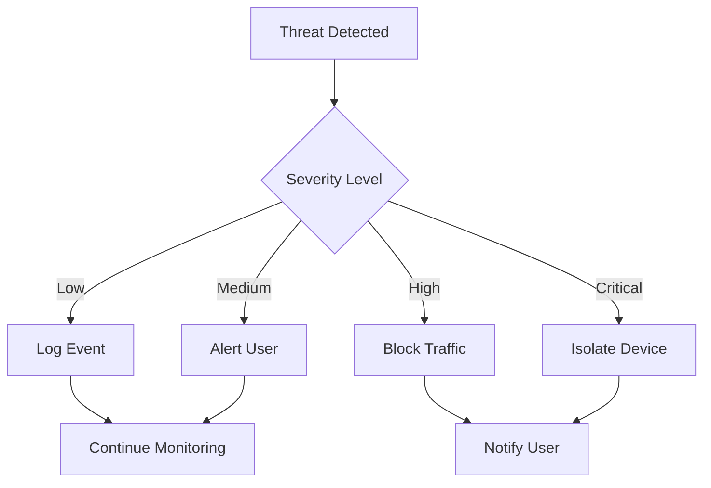

# Usage Guide

Learn how to use EdgeGuard to protect your home network effectively.

import Tabs from '@theme/Tabs';
import TabItem from '@theme/TabItem';

## Starting EdgeGuard

### Basic Start

```bash
# Activate virtual environment (if using)
source venv/bin/activate

# Run with sudo for network access
sudo python3 main.py
```

### Start with Custom Config

```bash
sudo python3 main.py --config config.yaml
```

### Background Mode

```bash
# Run as background service
sudo python3 main.py --daemon

# Check status
sudo python3 main.py --status

# Stop service
sudo python3 main.py --stop
```

:::tip Systemd Service

For automatic startup on boot, you can create a systemd service.

:::

## Understanding the Output

EdgeGuard provides real-time monitoring with color-coded output:

```bash
[INFO] EdgeGuard started - Monitoring network traffic
[INFO] Discovered 12 devices on network
[INFO] Device: 192.168.1.100 (Smart TV) - Status: Normal
[WARNING] Suspicious activity detected from 192.168.1.105
[ALERT] Potential threat: Port scanning detected
[ACTION] Blocked connection from 192.168.1.105
```

### Log Levels

| Level | Color | Meaning | Action Required |
|-------|-------|---------|-----------------|
| INFO | Blue | Normal operation | None |
| WARNING | Yellow | Suspicious activity | Monitor |
| ALERT | Orange | Threat detected | Review |
| ACTION | Red | Automated response | Verify |

## Device Discovery

EdgeGuard automatically discovers and catalogs devices:

### Discovery Process

1. **Network Scan** - Identifies active devices (30 seconds)
2. **Fingerprinting** - Determines device type and vendor
3. **Baseline Learning** - Establishes normal behavior patterns
4. **Continuous Monitoring** - Tracks device activity

### Viewing Devices

```bash
# List all discovered devices
python3 -c "from device_discovery import list_devices; list_devices()"
```

**Example Output:**

```
Device Inventory (12 devices)
━━━━━━━━━━━━━━━━━━━━━━━━━━━━━━━━━━━━━━━━━━━━━━━━━━━━━━━━━━━━
IP Address      MAC Address        Device Type    Status
━━━━━━━━━━━━━━━━━━━━━━━━━━━━━━━━━━━━━━━━━━━━━━━━━━━━━━━━━━━━
192.168.1.100   AA:BB:CC:DD:EE:FF  Smart TV       Normal
192.168.1.101   11:22:33:44:55:66  Smartphone     Normal
192.168.1.105   FF:EE:DD:CC:BB:AA  Unknown        ⚠️ Suspicious
```

## Threat Detection

EdgeGuard monitors for various security threats:

### Network Threats

<Tabs>
  <TabItem value="portscan" label="Port Scanning" default>

**Detection:** Multiple connection attempts to different ports

**Severity:** High

**Response:** Automatic blocking + alert

```log
[ALERT] Port scan detected from 192.168.1.105
        Scanned ports: 22, 80, 443, 8080, 3306
        Action: IP blocked for 24 hours
```

  </TabItem>
  <TabItem value="ddos" label="DDoS Attempts">

**Detection:** Abnormal traffic volume from single source

**Severity:** Critical

**Response:** Immediate blocking + device isolation

```log
[ALERT] DDoS attempt detected from 192.168.1.105
        Traffic: 1000 requests/second
        Action: Device isolated from network
```

  </TabItem>
  <TabItem value="exfiltration" label="Data Exfiltration">

**Detection:** Unusual outbound data transfer

**Severity:** High

**Response:** Alert + optional blocking

```log
[WARNING] Unusual data transfer from 192.168.1.100
          Destination: unknown-server.com
          Volume: 500MB in 5 minutes
          Action: Connection monitored
```

  </TabItem>
</Tabs>

### IoT-Specific Threats

| Threat Type | Detection Method | Response |
|------------|------------------|----------|
| Botnet Activity | C&C communication patterns | Block + isolate |
| Firmware Exploit | Abnormal device behavior | Alert + quarantine |
| Unauthorized Access | Failed auth attempts | Block source IP |
| Suspicious Connections | Unknown external servers | Alert + log |

## Automated Response

When threats are detected, EdgeGuard can respond automatically:

### Response Actions



### Manual Override

```bash
# Unblock an IP
python3 -c "from main import unblock_ip; unblock_ip('192.168.1.105')"

# Remove device from quarantine
python3 -c "from main import release_device; release_device('192.168.1.105')"
```

## Common Tasks

### Whitelist a Device

```bash
# Add trusted device to whitelist
python3 -c "from main import whitelist_device; whitelist_device('192.168.1.100')"
```

Or edit `config.yaml`:

```yaml
whitelist:
  - "192.168.1.100"  # Home server
```

### Check Threat Log

```bash
# View recent threats
tail -f logs/threats.log

# Search for specific IP
grep "192.168.1.105" logs/threats.log
```

### Export Device List

```bash
# Export to CSV
python3 -c "from device_discovery import export_devices; export_devices('devices.csv')"
```

## Monitoring Dashboard

Access the web dashboard (if enabled):

```bash
# Start web interface
python3 main.py --web --port 8080
```

Visit: `http://localhost:8080`

**Dashboard Features:**
- 📊 Real-time device status
- 🚨 Active threat alerts
- 📈 Network traffic graphs
- ⚙️ Configuration management

## Best Practices

:::tip Security Tips

1. **Regular Monitoring** - Check logs daily for unusual activity
2. **Update Models** - Keep AI models current with `ollama pull llama3.2:3b`
3. **Review Alerts** - Investigate all warnings, even false positives
4. **Maintain Whitelist** - Keep trusted devices list updated
5. **Backup Configs** - Save your configuration regularly

:::

### Daily Routine

- [ ] Check dashboard for alerts
- [ ] Review threat log
- [ ] Verify device inventory
- [ ] Update whitelist if needed

### Weekly Routine

- [ ] Review false positives
- [ ] Adjust detection threshold
- [ ] Update AI model
- [ ] Backup configuration

## Troubleshooting

### High False Positive Rate

**Problem:** Too many false alerts

**Solution:**
1. Increase anomaly threshold (0.7 → 0.8)
2. Add legitimate devices to whitelist
3. Review and adjust custom rules

### Missed Threats

**Problem:** Known threats not detected

**Solution:**
1. Decrease anomaly threshold (0.7 → 0.6)
2. Enable more detection rules
3. Update AI model to latest version

### Performance Issues

**Problem:** High CPU/RAM usage

**Solution:**
1. Increase scan interval (60s → 120s)
2. Use smaller AI model (3b → 1b)
3. Reduce logging level (DEBUG → INFO)

## Common Scenarios

<details>
<summary>New Device Joins Network</summary>

**What Happens:**
1. EdgeGuard detects new device automatically
2. Establishes baseline behavior (24-48 hours)
3. Monitors for anomalies
4. Alerts if suspicious activity detected

**Your Action:**
- Review device in dashboard
- Add to whitelist if trusted
- Monitor initial behavior

</details>

<details>
<summary>Threat Detected</summary>

**What Happens:**
1. Immediate alert notification
2. Automatic blocking (if enabled)
3. Detailed log entry created
4. AI analysis of threat type

**Your Action:**
- Review threat details in log
- Verify it's not a false positive
- Adjust rules if needed
- Report to community (optional)

</details>

<details>
<summary>False Positive</summary>

**What Happens:**
1. Legitimate activity flagged as threat
2. Device may be blocked/quarantined

**Your Action:**
1. Unblock the device/IP
2. Add to whitelist
3. Adjust detection threshold
4. Review similar alerts

</details>

## Next Steps

<div className="row">
  <div className="col col--6">
    <div className="card">
      <div className="card__body">
        <h3>🏗️ Architecture</h3>
        <p>Understand how EdgeGuard works under the hood</p>
        <a href="architecture" className="button button--primary">View Architecture →</a>
      </div>
    </div>
  </div>
</div>

